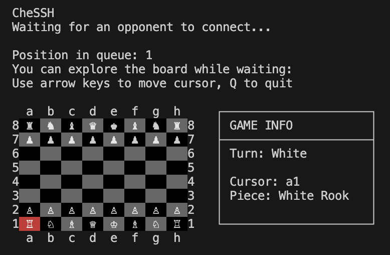

# CheSSH

A multiplayer chess game playable via SSH.

> [!IMPORTANT]
> It's pronounced like _"chess-ess-aych"_, or _"chesh"_ in your best Sean Connery impression.

## Play the game

```
ssh chessh.exe.xyz
```



You may need to wait for another player, or open a second terminal to play
against yourself. Players are matched when they connect. When an opponent
disconnects, you win.

## Running locally

```bash
go run ./ --local
```

Then:

```bash
ssh localhost -p 2222
```

`--local` writes an SSH host key under `~/.chessh/host_key` (or set
`SSH_HOST_KEY` / `SSH_HOST_KEY_FILE` yourself).

## Deploying

Infrastructure lives in `iac/` and targets [exe.dev](https://exe.dev):

- `ko_build` builds the Go binary and pushes
  `ghcr.io/imjasonh/playground/chessh` to GHCR
- `exedev_vm` runs that image as the `chessh` VM (`chessh.exe.xyz`)
- Terraform state is stored in Cloudflare R2
  (`playground-terraform-state` / `exe/chessh/terraform.tfstate`)
- A stable game SSH host key is generated once in Terraform and passed to
  the VM as `SSH_HOST_KEY`

On merges to `main` that touch `chessh/`, `.github/workflows/deploy-exe.yml`
applies the stack (same idea as `deploy-workers.yml` for Cloudflare Workers).
You can also apply by hand after minting an exe.dev API token and short-lived
R2 credentials:

```bash
cd iac/
# Set EXEDEV_TOKEN and docker-login to ghcr.io first.
export CLOUDFLARE_API_TOKEN=...
export CLOUDFLARE_ACCOUNT_ID=...
export TF_STATE_R2_ACCESS_KEY_ID=...   # parent R2 Access Key ID
bash ../../.github/scripts/mint-r2-temp-credentials.sh
terraform init \
  -backend-config="endpoints={s3=\"https://$CLOUDFLARE_ACCOUNT_ID.r2.cloudflarestorage.com\"}"
terraform apply
```

### Repo secrets for CI

| Secret | Purpose |
|--------|---------|
| `EXEDEV_SSH_PRIVATE_KEY` | OpenSSH private key whose public half is registered on exe.dev; CI mints `EXEDEV_TOKEN` from it |
| `TF_STATE_R2_ACCESS_KEY_ID` | Parent R2 Access Key ID (Object Read & Write on the state bucket). CI mints a short-lived S3 session from it via `CLOUDFLARE_API_TOKEN`; no long-lived secret key is stored |
| `CLOUDFLARE_ACCOUNT_ID` | Already used by Worker deploys; R2 S3 endpoint host |
| `CLOUDFLARE_API_TOKEN` | Creates the state bucket if missing, and mints temporary R2 credentials |

The GHCR package must be **public** so exe.dev can pull the image (the
community `exedev` provider has no `registry_auth`). CI publishes the package
and sets visibility after the first push.
