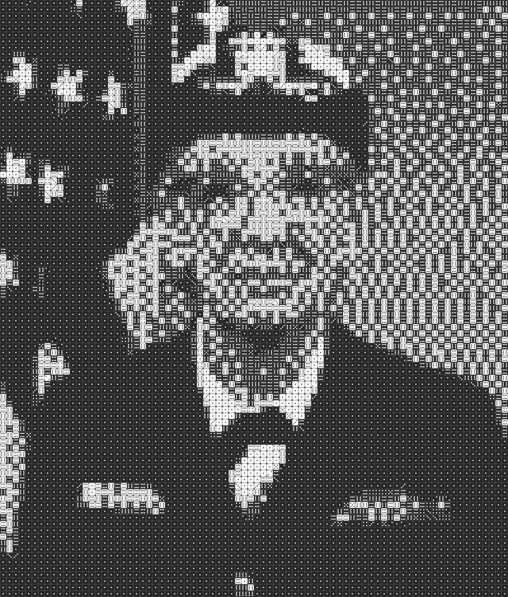
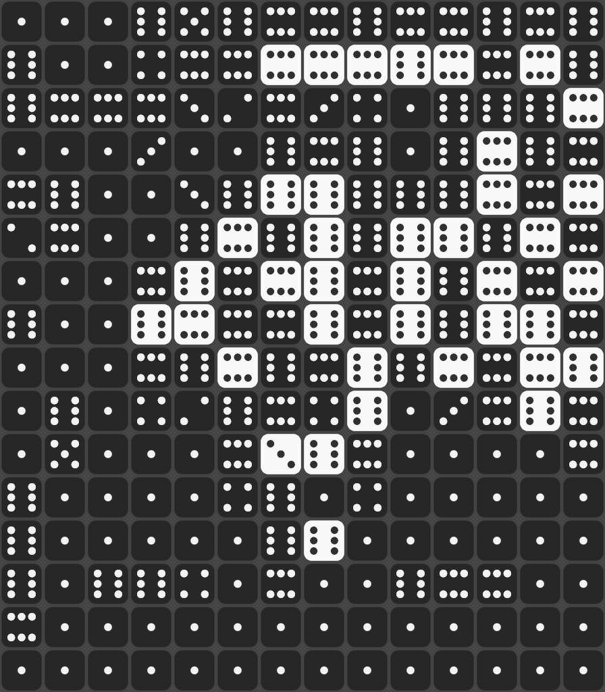
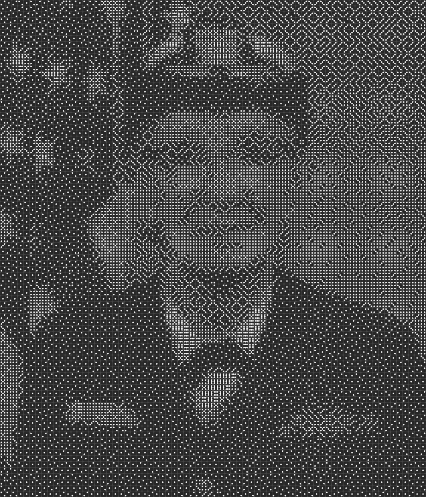

# dice-dither

Turn a photograph into a picture built out of dice.

The image is cut into a grid of square cells; each cell is replaced by the die
face whose own brightness comes closest, and the brightness a face can't quite
match is diffused into the cells around it. Because a die's brightness comes
from how many pips it shows — and from whether it's a black die with white pips
or a white die with black pips — the result reads as a photograph from across
the room and as a tray of dice up close.



*Rear Admiral Grace Hopper, 80 × 94 dice ([US Navy photograph, public
domain](https://commons.wikimedia.org/wiki/File:Grace_Hopper.jpg)). Regenerate
with `./render-examples.sh`.*

Up close, every cell really is a die face — 1 through 6 pips, laid down at
random quarter turns the way a hand-built mosaic would be:



With a single colour of die the pip count alone has to carry the picture, the
way a newspaper halftone works. There's much less contrast to play with, so it
helps to use larger pips:



## Usage

```bash
cargo run --release -- photo.jpg -o photo-dice.png
```

```
dice-dither [OPTIONS] <INPUT>
```

| Option | Default | What it does |
|--------|---------|--------------|
| `-o, --output <PATH>` | `<input>-dice.png` | Where to write the mosaic |
| `--cells <N>` | `72` | Dice across the picture |
| `--rows <N>` | aspect ratio | Dice down the picture |
| `--cell-px <N>` | `24` | Pixels per die |
| `--palette <light\|dark\|both>` | `both` | Which dice are in the box |
| `--dither <none\|floyd\|atkinson\|jarvis\|sierra-lite\|bayer>` | `floyd` | How leftover tone is spread |
| `--no-serpentine` | off | Scan every row left to right |
| `--allow-blank` | off | Also use blank (zero-pip) faces |
| `--gamma <F>` | `1.0` | Brightness exponent; above 1 darkens |
| `--invert` | off | Light becomes dark |
| `--normalize <auto\|on\|off>` | `auto` | Stretch source tones to what dice can show |
| `--tone-space <display\|linear>` | `display` | Brightness scale tones are matched on |
| `--no-rotate` / `--seed <N>` | rotate, `0x5EEDD1CE` | Random quarter turns |
| `--gap`, `--seam`, `--corner`, `--pip-radius`, `--pip-spread` | see `--help` | Die proportions |
| `--sheet <PATH>` | — | Write a plain-text plan for building it for real |
| `--inventory` | off | Print how many dice of each kind it needs |

`--sheet` writes the mosaic as one token per die (`W3` is a white die showing
three, `B5` a black one showing five) under a count of everything you'd need to
buy:

```
# dice-dither build sheet: 80 x 94 = 7520 dice
# B dice: 6019 (1:3815 2:78 3:60 4:89 5:66 6:1911)
# W dice: 1501 (1:170 2:9 3:24 4:23 5:18 6:1257)
B1 B1 B1 B1 B2 B1 B1 B1 B1 B1 B1 B2 W6 B1 B1 ...
```

## How it works

**Measure the dice, don't assume.** Each face is drawn once into a tile (rounded
body, round pips, anti-aliased from signed distance fields) and that tile's mean
brightness *is* its palette entry. Nothing hard-codes "a four is two thirds as
bright as a six"; change `--pip-radius` and the palette re-measures itself.

**The palette has a hole in it.** A black die tops out fairly dark even showing
six white pips, and a white die never gets very dark, so the middle of the range
is a gap no single die can hit. Error diffusion fills it by interleaving black
and white dice — which is exactly what real dice mosaics do — while the pip
counts do the fine shading at either end. Tones outside the range clamp instead
of accumulating an error debt that would smear across the picture.

**Two brightness scales.** `--tone-space linear` matches physical light, which
is what you want for a mosaic you actually intend to build: squint at the real
thing and the tones will be right. `--tone-space display` (the default) matches
on the gamma-encoded scale that monitors and image scalers average on, so the
picture looks right on a screen — a linear-matched mosaic looks noticeably dark
once a browser scales it down.

**One colour of die is a different medium.** `light` or `dark` alone spans only
a narrow band of brightness, so `--normalize auto` stretches the source into
that band: the picture survives as pip density even though the contrast on
screen is low. `both` needs no stretching and is left alone.

## Development

```bash
cargo fmt --check
cargo clippy --all-targets -- -D warnings
cargo test
./render-examples.sh   # refresh examples/ (downloads the source photo)
```

Source photographs land in `examples/source/`, which is git-ignored; only the
mosaics are committed.
