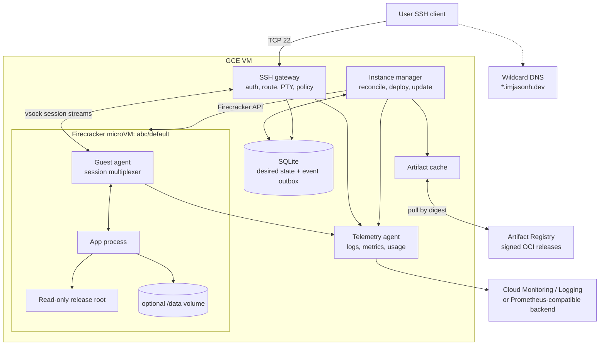

# Serverless SSH app platform

Status: proposed design

Scope: single GCE host, one scale-to-zero instance per app, many concurrent users

Future scope: multiple hosts, per-app replicas, and user sharding

This document designs a platform for hosting interactive terminal applications
at names such as `abc.imjasonh.dev`. Users connect with an SSH client,
authenticate at the platform edge, and join a shared app instance. An app may
give a user interactive control or a read-only view. App state is ephemeral by
default; an app may opt into limited durable local state.

“Serverless” here means the app author supplies an artifact and policy while the
platform owns placement, startup, scale-to-zero, routing, isolation, updates,
health, and accounting. It does not mean there are no servers.

## Contents

1. [Goals and non-goals](#1-goals-and-non-goals)
2. [Decisions at a glance](#2-decisions-at-a-glance)
3. [System model](#3-system-model)
4. [Architecture](#4-architecture)
5. [The app contract](#5-the-app-contract)
6. [Packaging and supply chain](#6-packaging-and-supply-chain)
7. [SSH routing and identity](#7-ssh-routing-and-identity)
8. [App sessions and read-only viewers](#8-app-sessions-and-read-only-viewers)
9. [Firecracker isolation](#9-firecracker-isolation)
10. [State and storage](#10-state-and-storage)
11. [Deployment and updates](#11-deployment-and-updates)
12. [Networking](#12-networking)
13. [Observability and usage records](#13-observability-and-usage-records)
14. [Security and abuse controls](#14-security-and-abuse-controls)
15. [Reliability, backup, and recovery](#15-reliability-backup-and-recovery)
16. [Control plane and data model](#16-control-plane-and-data-model)
17. [Operations](#17-operations)
18. [Future scaling](#18-future-scaling)
19. [Alternatives considered](#19-alternatives-considered)
20. [Delivery phases](#20-delivery-phases)
21. [Confirmed product decisions](#21-confirmed-product-decisions)

---

## 1. Goals and non-goals

### Goals

- Route `ssh abc.imjasonh.dev` to the app named `abc`.
- Authenticate people at the platform boundary, without giving apps raw SSH
  credentials or private keys.
- Let many users share one live app process and its local state.
- Support both interactive participants and read-only observers.
- Package apps reproducibly, promote immutable releases, and roll back safely.
- Isolate untrusted or buggy app code more strongly than a normal container.
- Measure sessions and resource consumption without recording terminal contents
  by default.
- Stop an app after ten minutes with no active users and start it on demand.
- Make one GCE VM operationally sound before introducing distributed systems.
- Preserve an upgrade path to clean multi-host failover, multiple regions, and
  sharded app instances.

### Non-goals for the first version

- Horizontal replicas or transparent live migration.
- Arbitrary public TCP/UDP services. SSH is the only public app protocol.
- A general-purpose VM product or shell account. The app gets one declared
  executable, not an SSH daemon or login shell.
- Exactly-once session accounting. Durable, idempotent at-least-once event
  ingestion is sufficient.
- Platform-level terminal recording. This has substantial privacy, secret
  handling, access control, and retention implications.
- In-place update of persistent state with automatic rollback. Schema and data
  migrations need explicit app-owned handling.

## 2. Decisions at a glance

These choices are confirmed for the initial product. Implementation details can
evolve behind the contracts in this document.

| Area | Decision |
|------|----------|
| Publishers | Owner only initially, then trusted publishers; design the boundary for untrusted publishers later |
| Visibility | Public apps for authenticated users initially; private app policy later |
| Public endpoint | One dual-stack GCE VM; use its external IPv6 `/96` for zero-config per-app addresses and one shared IPv4 fallback |
| App selection | Destination IPv6 when available; app-as-username or an optional route command on shared IPv4 |
| SSH edge | A platform-owned SSH gateway terminating SSH and authorizing sessions |
| User auth | Automatic stable profile from an SSH public key; OIDC device flow and account linking for users without a key |
| Guest protocol | Gateway-to-guest private `AF_VSOCK` stream with a small framed session protocol |
| App SDK | Go/Charm SDK; the platform terminates SSH and apps implement the platform session contract |
| Packaging | OCI image indexes in Artifact Registry, pinned by digest |
| Guest image | Platform-owned minimal kernel + root filesystem; app image unpacked into a read-only root |
| Supply chain | Keyless Sigstore signature and provenance policy before deployment |
| Isolation | One Firecracker microVM per app instance, never one shared guest for multiple apps |
| Process model | One long-lived app supervisor/process per app instance; sessions attach over local IPC |
| State | Ephemeral by default; opt-in dedicated ext4 volume with daily snapshots for limited durable state |
| Scale-to-zero | Stop after ten minutes with no active users; serialize cold starts on the next connection |
| Updates | Blue/green drain for ephemeral apps; single-writer drain/snapshot/recreate for persistent apps |
| Availability | Brief maintenance window for stateful updates in v1; no pretend zero-downtime guarantee |
| Ingress | SSH only; no guest listener exposed on the host network |
| Egress | Denied by default; explicit policy required to enable any destination |
| Secrets | Inject at boot into guest memory; do not bake into image or persistent disk |
| Logs | Structured platform/app logs; no session payloads by default |
| Metrics | OpenTelemetry/Prometheus-compatible metrics for gateway, manager, host, and guests |
| Usage | Durable pseudonymous session and resource events suitable for later usage billing |
| Control plane | SQLite on the single host with WAL and backups; API boundaries designed for replacement |
| Restart policy | Start apps on demand; attach the persistent volume only for apps that opted into one |

## 3. System model

The platform has three important nouns:

- **App**: named configuration and authorization policy, for example `abc`.
- **Release**: immutable app artifact and configuration schema, identified by an
  OCI digest.
- **Instance**: the stable identity of an app runtime. Its Firecracker microVM
  may be stopped, and it has a persistent data volume only when the app opts in.

In v1 there is exactly one logical instance for each enabled app:

```text
app "abc"
  └── instance "abc/default"
        ├── release sha256:123...
        ├── optional data volume abc-default
        ├── interactive session (Alice)
        ├── observer session (Bob)
        └── observer session (Chen)
```

This distinction matters even on one machine. Releases are replaceable;
instances own identity and optional data; sessions and default app state are
ephemeral. A stopped logical instance consumes storage metadata but no guest CPU
or memory.

The app itself is not an SSH server. It is a terminal application implementing
the platform's local session protocol. Keeping SSH out of guests gives the
platform one authentication and audit boundary and avoids maintaining host keys,
authorized-key files, sshd configuration, and network listeners per app.

## 4. Architecture



### Components

#### SSH gateway

The only internet-facing process. It:

1. completes the SSH handshake using platform host keys;
2. authenticates a platform user;
3. obtains the original hostname from a platform route request;
4. resolves it to an app and checks authorization;
5. requests or locates the running instance;
6. opens a private vsock stream to the guest agent;
7. proxies terminal bytes, resize events, signals, and disconnects;
8. emits session lifecycle and byte-count events.

The gateway should use an SSH protocol library, not shell out to `sshd`. A
purpose-built server can reject port forwarding, file transfer, agent
forwarding, arbitrary commands, and unsupported channels before they reach an
app.

#### Instance manager

A privileged host service that reconciles declared desired state with running
microVMs. It owns artifact verification, image preparation, Firecracker
configuration, volumes, network policy, health checks, restart backoff,
updates, backups, and garbage collection.

Only this process needs access to `/dev/kvm`, Firecracker control sockets, block
devices, and host networking. The SSH gateway asks it for instance/session
endpoints over a narrow authenticated local API.

#### Guest agent

PID 1 inside every microVM. It:

- mounts an ephemeral data filesystem or the app's optional persistent volume;
- sets resource and process limits inside the guest;
- obtains boot configuration and secrets over vsock;
- launches the app as an unprivileged UID;
- exposes health and metadata endpoints over vsock;
- translates gateway session streams into the app's local protocol;
- drains and terminates the app during updates;
- exports logs and resource counters.

The guest agent is part of the trusted platform image, not supplied by the app.

#### State store

SQLite is appropriate for desired state and event buffering on one host. Use
WAL mode, strict migrations, foreign keys, a busy timeout, and regular online
backups. Store large logs and snapshots elsewhere. The database is not the app
data plane and should never contain terminal streams.

## 5. The app contract

An app release consists of:

1. a Linux OCI image for one supported architecture;
2. an app manifest attached as an OCI artifact or stored at a fixed image path;
3. a process that implements the local session protocol;
4. optional migration, health, readiness, and shutdown hooks.

Example manifest:

```yaml
apiVersion: sshapps.imjasonh.dev/v1alpha1
kind: App
metadata:
  name: abc
spec:
  image: us-docker.pkg.dev/PROJECT/ssh-apps/abc@sha256:...
  command: ["/app/abc", "serve"]
  session:
    protocol: sshapps-session-v1
    interactivePolicy: single-writer
    observers: true
    maxDuration: 8h
  runtime:
    scaleDownAfter: 10m
  resources:
    vcpu: 1
    memory: 256Mi
    disk: 2Gi
    pids: 64
    sessions: 100
  network:
    egress: deny
  state:
    mode: ephemeral
    mount: /data
  health:
    startupTimeout: 15s
    interval: 10s
    failureThreshold: 3
  update:
    strategy: recreate
    drainTimeout: 5m
    snapshotBeforeUpdate: true
```

### Filesystem

The contract is:

- `/app`: read-only app content from the release;
- `/data`: writable app-instance state, ephemeral by default and durable only
  when `state.mode` is `persistent`;
- `/tmp`: writable tmpfs with a size limit;
- `/run/sshapps`: guest-agent sockets and ephemeral metadata;
- all other filesystem paths read-only or ephemeral.

Apps must not depend on writes outside `/data`. The platform may replace every
other byte on restart or update. With the default `ephemeral` mode, it may also
replace `/data` whenever the microVM stops. A persistent app instead declares:

```yaml
state:
  mode: persistent
  mount: /data
  size: 2Gi
  backupPolicy: daily
```

Persistent state is intentionally an opt-in capability rather than an accidental
promise made to every app.

### Process behavior

The process receives:

- `SSHAPPS_APP_NAME`;
- `SSHAPPS_INSTANCE_ID`;
- `SSHAPPS_RELEASE_DIGEST`;
- `SSHAPPS_SESSION_SOCKET`;
- declared secrets as file paths under a memory-backed directory;
- a shutdown signal followed by a configured grace period.

It writes structured JSON logs to stdout/stderr. It must not use stdout as the
user's terminal stream; terminal sessions travel through the session socket.

### Go/Charm SDK

The first supported authoring experience is a Go SDK designed to compose with
Charm's Bubble Tea and Lip Gloss libraries. The platform, not the app, runs the
SSH server. The SDK should expose:

- app startup and shutdown hooks;
- a stable shared model/store for the singleton app instance;
- authenticated session identity and participant/observer mode;
- per-session terminal size, renderer, input stream, and cancellation;
- broadcast/state-change primitives that trigger redraws for all sessions;
- controller handoff for single-writer apps;
- health, quiesce, and optional state migration hooks.

Apps built around Wish can reuse their Bubble Tea models and views, but do not
embed a Wish SSH listener. This keeps authentication, routing, watch-only
enforcement, resource accounting, and terminal policy at one platform edge.

### Health

Distinguish:

- **startup**: initialization and migrations completed;
- **readiness**: safe to accept new sessions;
- **liveness**: process is making progress.

Health runs over local IPC, not shell commands from the host. A failed readiness
check stops new sessions. Repeated liveness failures trigger a bounded restart
with exponential backoff and a terminal `failed` state after a crash-loop
threshold.

## 6. Packaging and supply chain

### Why OCI

OCI images already provide content-addressed layers, registries, caching,
multi-architecture indexes, signatures, attestations, retention controls, and
familiar build tools. Firecracker does not boot an OCI image directly, but that
is an implementation detail of the host image preparer.

The deployment identity is always a digest:

```text
us-docker.pkg.dev/PROJECT/ssh-apps/abc@sha256:0123...
```

Tags such as `main` or `v1.4.0` are discovery aliases, never deployment
identities.

### Build

Recommended pipeline:

1. Build a minimal OCI image with `ko`, BuildKit, or `apko`.
2. Generate an SBOM.
3. Run tests and vulnerability policy checks.
4. Push to Artifact Registry.
5. Attach app manifest, SBOM, and SLSA provenance as OCI referrers.
6. Sign the digest with keyless Sigstore in CI.
7. Submit the immutable digest to the platform.

The host verifies registry location, signature identity, provenance builder, and
optional vulnerability policy before caching any release. Verification happens
again at activation time so a compromised control-plane row cannot bypass
policy.

### Turning OCI into a microVM root

Use a stable, platform-owned kernel and base guest filesystem. For each release,
the image preparer:

1. pulls and verifies OCI layers;
2. safely unpacks them without preserving unsafe device nodes, setuid bits, or
   host ownership;
3. creates a deterministic read-only ext4 or EROFS release image;
4. records its source digest and generated image digest;
5. caches it by digest.

Do not ask every app author to produce a kernel/rootfs pair. That couples apps
to Firecracker internals and makes security patching, guest-agent upgrades, and
artifact validation much harder.

For v1, one host architecture (`linux/amd64` or `linux/arm64`, matching the GCE
host) is enough. Require an OCI index before adding heterogeneous hosts.

### Platform image lifecycle

Kernel and guest-agent versions are separate from app releases. Pin and sign a
versioned platform image. An app instance therefore records both:

```text
app release:      sha256:app...
platform runtime: sha256:runtime...
```

This permits emergency kernel/agent rollouts without rebuilding every app.

## 7. SSH routing and identity

### A hostname caveat

SSH does not send the DNS hostname in its base protocol the way TLS sends SNI.
After DNS resolution, the server normally sees only a TCP connection. Therefore
wildcard DNS alone cannot tell the gateway whether the user typed
`abc.imjasonh.dev` or `xyz.imjasonh.dev`.

GCE provides a useful low-friction path for IPv6 clients: a dual-stack VM
network interface [receives an external `/96` IPv6
range](https://cloud.google.com/compute/docs/ip-addresses/configure-ipv6-address),
and addresses within the range can be configured on the host OS and routed to
that VM. Allocate a stable `/128` from that range for every app, publish it as
the app's `AAAA` record, and map the accepted socket's local destination address
back to the app. Then the desired command works without client configuration:

```console
$ ssh abc.imjasonh.dev
```

The same trick is not available behind one shared IPv4 address. All app `A`
records lead to an indistinguishable listener. The zero-configuration IPv4
fallback puts the app in the SSH username:

```console
$ ssh abc@ssh.imjasonh.dev
```

User identity comes from authentication, not this protocol username, so the
gateway is free to interpret `abc` as the route.

Users who want the prettier app hostname over IPv4 can install this one-time
OpenSSH configuration. `RemoteCommand` supports `%n`, which expands to the
original hostname as entered on the command line before `HostName` rewriting:

```sshconfig
Host *.imjasonh.dev
  HostName ssh.imjasonh.dev
  RemoteCommand route %n
  RequestTTY force
```

The client opens a session channel and requests execution of
`route abc.imjasonh.dev`. The gateway treats this as platform metadata rather
than a guest command, validates the exact grammar and DNS suffix, and routes to
`abc`.

This configuration reserves `RemoteCommand`, so a user cannot also pass an
arbitrary command on the same invocation. That is consistent with the v1 app
contract, which exposes an interactive app rather than remote command
execution. A platform CLI can construct the equivalent SSH request for clients
that cannot use this configuration. A generated per-app `SetEnv` entry is also
possible, but
`SetEnv SSHAPPS_HOST=%h` is **not**: OpenSSH does not expand hostname tokens in
`SetEnv`.

Another viable protocol extension is an SSH certificate critical option or a
custom pre-session request, but stock clients do not make it as ergonomic.
Routing precedence is destination IPv6, exact route request, then protocol
username. Reject conflicting values. Test IPv6 reachability, IPv4 fallback,
Happy Eyeballs behavior, and OpenSSH configuration on every supported client.

### DNS and host keys

- `ssh.imjasonh.dev` points to the VM's shared IPv4 and primary IPv6 addresses.
- Each app `A` record points to the shared IPv4 address; each app `AAAA` record
  points to its allocated `/128` within the VM's static external IPv6 `/96`.
- Keep the `/96` static. Moving an app to another host later requires an edge
  routing layer or DNS update; do not make the address its durable instance ID.
- The gateway presents the same platform host key for every app hostname.
- Publish SSHFP records if DNSSEC is available, but do not rely on SSHFP alone.
- Store host private keys in a tightly permissioned persistent host path or
  retrieve them from Secret Manager at boot.
- Rotate by publishing old and new public keys during an overlap window.

### Authentication

Every session requires authentication; there is no anonymous participant or
observer mode.

The lowest-friction path accepts a valid SSH public-key proof and automatically
creates a stable, randomly named profile keyed by its fingerprint. This proves
continuity of a pseudonymous identity, not a person's real-world identity.
There is no registration form or allowlist for public apps:

1. client proves possession of a supported modern SSH key (prefer Ed25519 and
   hardware-backed security-key algorithms);
2. gateway looks up the fingerprint or creates an immutable user ID and random
   display profile;
3. app authorization is evaluated for that user ID;
4. only normalized identity claims are sent to the guest.

For clients without a key, offer SSH keyboard-interactive authentication with
an OIDC device flow: display a short URL and code, wait for browser completion,
then create a profile and authorize the SSH connection. The browser flow can
also link additional SSH keys to an existing profile. Never accept a reusable
platform password.

Later, the same OIDC identity can issue short-lived OpenSSH user certificates.
Certificates reduce key lookup latency and support expiration and roles, but
require careful CA protection and revocation semantics. Account linking must
require proof of both the existing account and new key; fingerprint collision
or unverified email matching must never merge profiles.

Never pass `SSH_AUTH_SOCK`, public-key blobs, OIDC tokens, source credentials, or
agent forwarding into a guest. Apps receive:

```json
{
  "session_id": "ses_...",
  "user_id": "usr_...",
  "display_name": "Alice",
  "roles": ["participant"],
  "mode": "interactive",
  "connected_at": "2026-07-01T00:00:00Z"
}
```

### Authorization

The gateway makes the authoritative decision:

- apps are public to every authenticated profile initially;
- private, allowlisted, and group-restricted policy can be added later without
  changing the guest identity contract;
- user may observe, interact, administer, or not connect;
- per-user and per-app concurrency limits are available;
- suspended users and disabled apps are rejected before an instance starts.

The guest receives the resulting mode and claims but cannot upgrade them.

### SSH features

Allow only:

- one `session` channel;
- PTY allocation with sanitized terminal type and bounded dimensions;
- terminal resize events;
- the platform route command when needed;
- a small signal allowlist;
- optional platform-defined commands such as `status`.

Reject shell escape commands, arbitrary `exec`, subsystems (`sftp`/`scp`), TCP
and Unix forwarding, X11 forwarding, agent forwarding, and unrecognized
environment variables.

## 8. App sessions and read-only viewers

The platform cannot reliably create “watch-only” behavior by merely discarding
stdin. A full-screen terminal app may personalize output, use alternate screens,
or expose secrets to one user. Shared viewing must be an explicit app/session
contract.

### Session protocol

Use a versioned, length-delimited framed protocol over a Unix socket in the
guest. It needs messages for:

- attach with identity, authorization mode, terminal dimensions, and metadata;
- server-to-client terminal bytes;
- client-to-server input bytes (interactive mode only);
- resize;
- signal;
- title/status metadata;
- detach reason;
- heartbeat/backpressure;
- protocol error.

Protobuf or a compact documented binary framing is preferable to newline JSON
because terminal payloads are arbitrary bytes. Set maximum frame sizes and
bound all queues.

### Collaboration policies

Apps declare one policy:

- `multi-writer`: all interactive users may send input;
- `single-writer`: one active controller, with app-defined handoff;
- `app-managed`: the app interprets roles and input itself;
- `observe-only`: nobody sends input.

The gateway enforces the outer bound (an observer's input never reaches the
guest), while the app owns semantic collaboration.

### Slow consumers

A read-only viewer can be much slower than the app. Never let one client block
the shared process. Give each session a bounded output buffer. On overflow:

1. emit a metric;
2. optionally send a resynchronization/snapshot frame if the app supports it;
3. otherwise disconnect the slow session with a clear reason.

Do not buffer unbounded terminal output to disk.

### Disconnect and resume

V1 sessions are not resumable: disconnecting ends the session, while the shared
app continues. Add resume only with app-level snapshot/redraw support and a
short-lived, single-use resume token. Replaying raw terminal bytes is not enough
to reconstruct every terminal state safely.

## 9. Firecracker isolation

Firecracker supplies a useful VM boundary, but it is not the whole sandbox.
The host services, guest kernel, image preparer, KVM device, and update path are
all part of the trusted computing base.

### Per-instance microVM

Each app instance gets:

- a unique Firecracker process and jail directory;
- a unique vsock CID;
- a read-only app/root block device;
- a dedicated writable data block device;
- its own network namespace and TAP device if egress is enabled;
- fixed vCPU and memory allocation;
- no host filesystem mounts;
- no host devices beyond explicitly configured virtual devices.

Never place unrelated apps in the same guest. That would collapse the primary
security boundary and complicate resource and usage accounting.

### Jailer and host hardening

Run Firecracker with `jailer` under a unique unprivileged host UID/GID. Apply:

- chroot;
- cgroup v2 CPU, memory, pids, and I/O limits;
- seccomp filters;
- minimal Linux capabilities;
- `no_new_privs`;
- read-only host paths;
- per-instance network namespace;
- systemd sandboxing for host services;
- a host firewall allowing public traffic only to the gateway/admin endpoints.

Keep the GCE VM dedicated to this platform. Disable project-wide SSH keys and
interactive host login where possible; use OS Login/IAP and audited break-glass
access.

### Guest hardening

The platform kernel should:

- include only required virtio, ext4/EROFS, vsock, networking, and entropy
  support;
- disable loadable modules, unprivileged BPF, debug interfaces, and unnecessary
  filesystems/protocols;
- boot with a read-only root;
- run the app as a non-root UID;
- apply guest seccomp and rlimits;
- have no sshd, package manager, compiler, shell, or cloud metadata credentials.

The guest agent must treat every manifest value, image path, frame, and log line
as attacker-controlled.

### Resource limits

Enforce twice where practical:

- Firecracker/cgroup limits protect the host;
- guest limits protect the guest agent from the app.

At minimum limit vCPU, memory, PIDs, disk bytes/inodes, block I/O, egress
bandwidth, sessions, per-session queues, log rate, and restart frequency. Define
whether out-of-memory kills restart the instance or mark it unhealthy.

## 10. State and storage

### Ephemeral default

Most apps get an instance-scoped ephemeral `/data`. It survives app-process
restarts inside one microVM but is discarded when that microVM scales to zero,
is replaced, or the host fails. This is the inexpensive default and must be
visible in the app manifest, SDK, and operator UI.

An app opts into persistence only when its product semantics require it. The
platform can limit which publishers receive persistent volumes and enforce
small volume-count and byte quotas.

### Volume model

Each persistent instance owns a sparse ext4 file or logical volume on a zonal
GCE Persistent Disk, identified independently of any release. The manager
attaches it as a virtio block device; the guest agent mounts it at `/data` with
`nodev,nosuid,noexec` by default. Apps that need executable state must request
an exception.

Use project quotas or fixed-size block devices so an app cannot fill the host
filesystem. Monitor bytes and inodes. Leave deliberate host headroom for image
pulls, snapshots, logs, SQLite, and crash dumps.

### Consistency

Persistent local state means:

- one attached writer at a time;
- no transparent relocation while running;
- update and backup operations coordinate with the app;
- loss of the VM does not lose the zonal Persistent Disk, but zone loss,
  corruption, or operator error can require snapshot recovery.

Document that apps must flush durable state before reporting quiesced. `fsync`
semantics ultimately rely on the GCE persistent disk and host filesystem.

### Backup

Take daily snapshots initially, using application-consistent backups where
possible:

1. mark the app not ready and stop new sessions;
2. ask it to quiesce and flush;
3. freeze or cleanly unmount the filesystem;
4. take a GCE Persistent Disk snapshot or copy a filesystem image;
5. resume and record the snapshot generation.

Crash-consistent snapshots are acceptable only for apps whose storage format
explicitly tolerates them. Encrypt snapshots, set retention, test restoration,
and record both the app release and platform runtime needed for recovery. Daily
snapshots imply up to 24 hours of recovery-point loss after corruption or
deletion; stronger policies can be added per app later.

### Data lifecycle

Disabling an app stops compute and retains only opted-in persistent data.
Deleting an app should enter a recoverable tombstone period before removing its
volume and backups. Require a separate explicit purge action, audit it, and
make it idempotent. Ephemeral state is deleted immediately when its microVM
stops and is not recoverable.

### Scale-to-zero

When the active session count reaches zero, start a ten-minute idle timer. A new
authenticated session cancels the timer. If it expires:

1. mark the instance `stopping` so only one lifecycle operation can win;
2. ask the app to flush and stop within a short grace period;
3. stop and destroy the microVM;
4. discard ephemeral `/data`, or detach and retain persistent `/data`;
5. retain the release image cache and logical instance metadata.

The next authorized connection atomically changes the instance to `starting`.
Concurrent arrivals join one start operation rather than launching duplicate
microVMs. Keep the SSH connection alive with platform-generated startup status,
enforce a startup deadline, and attach all waiting sessions after readiness.
Measure cold-start latency from authenticated admission to first app byte.

## 11. Deployment and updates

### Desired-state deployment

Deploying means changing an app's desired release digest. The manager reconciles
to it; an API request does not manually mutate a Firecracker process. The
strategy depends on whether the app uses ephemeral or persistent state.

### Ephemeral update semantics

Ephemeral apps use a blue/green drain:

1. pull, verify, boot, and health-check the new release while the old one runs;
2. atomically route new sessions to the new instance;
3. cordon the old instance but leave existing sessions attached;
4. notify those sessions and allow up to the default five-minute drain deadline;
5. disconnect any sessions still present at the deadline and destroy the old
   instance.

If the new release fails readiness, keep routing to the old instance and mark
the deployment failed. During the bounded drain, old users share the old
in-memory state while new users share the new state. This is an explicit,
temporary exception to the normal one-instance rule and is acceptable only
because the state is declared ephemeral. Apps may configure a shorter deadline.

### Persistent update semantics

The following sequence applies to apps with a single-writer persistent volume:

```mermaid
sequenceDiagram
    participant O as Operator / CI
    participant C as Control plane
    participant M as Instance manager
    participant R as Artifact Registry
    participant G as Guest

    O->>C: deploy app=abc digest=sha256:new
    C->>C: authorize + record deployment
    M->>C: observe desired release
    M->>R: pull digest + referrers
    M->>M: verify signature/provenance and prepare root
    M->>G: stop accepting sessions; request drain
    G-->>M: quiesced
    M->>M: snapshot /data
    M->>M: stop old VM; boot new release
    M->>G: startup/readiness checks
    alt healthy
        M->>C: mark deployment succeeded
    else failed
        M->>M: stop new; boot old release
        M->>C: mark rolled back
    end
```

True zero-downtime updates are not generally possible for a singleton process
with a single-writer local volume. V1 should promise a controlled maintenance
window:

1. pull and prepare the new release while the old one runs;
2. stop admitting sessions;
3. notify connected users and wait up to the default five-minute drain
   deadline;
4. ask the app to quiesce;
5. snapshot `/data`;
6. stop the old microVM;
7. boot and health-check the new microVM against the same volume;
8. reopen admission.

If startup fails before a destructive migration, boot the old release. If the
new app changed persistent data incompatibly, binary rollback may be unsafe.
Therefore every app update declares one of:

- `dataCompatible`: old release can reopen data after the new release;
- `forwardOnly`: rollback requires restoring the pre-update snapshot;
- `noMigration`: release does not change durable format.

The platform must never automatically restore a data snapshot while sessions
could still be writing to the current volume.

### Migrations

Migrations should be explicit and idempotent. The app runs them during startup
before readiness. Record a data schema version in `/data`. Require a dry-run or
validation hook where feasible. A migration timeout or crash fails deployment.

For risky releases, support an operator approval point after the snapshot and
before migration. Do not infer data compatibility from image tags.

### Rollout controls

Even with one instance:

- deduplicate deployment requests by digest;
- serialize operations per app;
- use generation numbers to reject stale reconciliation;
- enforce max drain/startup/migration durations;
- retain the prior release image for fast rollback;
- expose deployment events and reasons;
- garbage-collect only unreferenced artifacts after a safety period.

## 12. Networking

### Ingress

Only the SSH gateway accepts public traffic. Guests receive session streams over
vsock, which avoids exposing guest ports or using network identity for trust.
The host administration API should be private, bound to localhost/IAP, or
protected by strong identity-aware access.

### Egress

Default to no guest NIC. Apps that need outbound access declare it and receive a
TAP device in a dedicated network namespace. Apply nftables rules on the host.

Useful policy levels:

- `deny`: no IP networking;
- `https`: DNS plus outbound TCP 443, with metadata/private ranges blocked;
- `allowlist`: declared CIDRs and ports;
- `unrestricted`: exceptional, still blocking host/control-plane/metadata
  networks.

Always block:

- GCE metadata (`169.254.169.254` and metadata DNS names);
- host link-local and management addresses;
- RFC1918/VPC ranges unless explicitly needed;
- other guest subnets;
- SMTP and commonly abused amplification ports by default.

DNS can undermine hostname allowlists because addresses change. Prefer a
policy-aware egress proxy for hostname restrictions, or treat CIDR rules as the
actual security boundary. Rate-limit bytes and connections.

### Secrets

Fetch app secrets from Secret Manager using the host service account. Deliver
only app-scoped values over an authenticated bootstrap vsock channel, write them
to guest tmpfs with restrictive permissions, and remove them from the
environment when possible. Secrets must be redacted from logs and never copied
to `/data`, snapshots, manifests, image layers, or usage events by the platform.

The host service account should have per-secret access, Artifact Registry read,
telemetry write, and snapshot permissions—no broad project editor role. Guests
get no GCP identity.

## 13. Observability and usage records

Observability has three distinct purposes and data classes:

1. **Operations**: health, latency, errors, saturation.
2. **Audit**: who changed policy, deployed, connected, or deleted data.
3. **Usage**: session duration and metered resources.

Keep them logically separate even if they initially share a backend.

### Metrics

Recommended metrics:

| Component | Metrics |
|-----------|---------|
| Gateway | connections, auth failures, authorization denials, handshake/session setup latency, active sessions, bytes in/out, disconnect reasons |
| Manager | desired/running instances, starts, start latency, crashes, restart backoff, deployments, rollbacks, health failures |
| Host | CPU, memory, disk bytes/inodes/latency, KVM availability, network, file descriptors |
| Guest/app | CPU time, memory high-water mark, OOMs, PIDs, data bytes/inodes, app health, session count, log drops |
| Usage pipeline | outbox depth, event age, export failures, duplicate events |

Labels must have bounded cardinality. `app_id`, release digest prefix, status,
and reason are appropriate; `user_id`, `session_id`, IP, and full digest do not
belong in metric labels.

### Logs

Use structured logs with timestamp, severity, component, app/instance identity,
release, and trace/correlation ID. Keep user and session identifiers only when
needed, preferably pseudonymous stable IDs. Rate-limit per-app logs and report
dropped counts.

Never log:

- terminal input or output;
- authentication signatures or key material;
- secrets and environment contents;
- full command payloads supplied by users;
- raw IP addresses beyond the documented security retention window.

Apps can opt into their own content logging, but that is an app privacy policy,
not a platform default.

### Traces

Trace the control path:

```text
SSH accept -> authenticate -> authorize -> locate/start instance
           -> guest attach -> first output byte
```

Also trace deployments and backups. Do not put terminal payloads in spans.
Propagate a generated correlation ID to the guest, not arbitrary incoming trace
headers.

### Usage event model

Emit immutable events:

```json
{
  "event_id": "evt_01...",
  "type": "session.ended",
  "occurred_at": "2026-07-01T00:42:00Z",
  "app_id": "app_01...",
  "instance_id": "ins_01...",
  "release_digest": "sha256:...",
  "session_id": "ses_01...",
  "user_id": "usr_01...",
  "mode": "observer",
  "connected_ms": 2520000,
  "bytes_from_user": 0,
  "bytes_to_user": 148221,
  "disconnect_reason": "client_closed",
  "schema_version": 1
}
```

For long sessions, emit periodic cumulative checkpoints with the same session
ID and monotonically increasing sequence number. Also meter per-instance
vCPU-seconds, memory-byte-seconds, disk-byte-hours, egress bytes, and active
instance time. Session duration alone is not a useful measure of platform cost.

Write events transactionally to a local outbox before acknowledging completion,
then export asynchronously. Consumers deduplicate by `event_id` and compute
deltas from cumulative counters. Synchronize the host clock and use monotonic
time for durations.

Collect these counters from the beginning for capacity analysis and future
usage-based billing, but do not call them billable until correction events,
late-event windows, pricing versions, user-visible statements, dispute handling,
and retention are specified. Usage identity is pseudonymous; terminal content
is never a usage dimension.

### Retention

Define retention before collecting data. A reasonable starting point:

- operational logs: 14–30 days;
- high-resolution metrics: 30 days, aggregates longer;
- security/audit events: 1 year;
- usage events: according to billing/legal needs;
- source IPs: shortest practical security window;
- terminal contents: not collected.

Provide an auditable user-data deletion path while preserving minimally
necessary aggregated or security records.

### Alerts and service-level indicators

Alert on symptoms:

- gateway unavailable or elevated session setup failures;
- authentication failure spike;
- instance crash loop;
- app readiness failure;
- host memory or disk exhaustion risk;
- backup age beyond policy;
- usage outbox age/depth;
- deployment stuck past deadline;
- telemetry pipeline failure.

Initial SLIs:

- gateway successful handshake rate;
- authorized session attach success rate;
- p50/p95 time to first app byte;
- availability of instances with current session demand;
- successful backup freshness;
- deployment success/rollback rate.

## 14. Security and abuse controls

### Threat boundaries

Assume:

- app images can be malicious;
- users can be malicious;
- an app may try to impersonate users or access another app's data;
- terminal bytes and dimensions are attacker-controlled;
- registry tags can move;
- external destinations may be hostile;
- host compromise compromises all apps on that host.

Firecracker reduces guest-to-host risk; it does not eliminate it. Patch the GCE
host, Firecracker, kernel/KVM, guest kernel, and guest agent promptly. Reboot
the host for kernel fixes under an explicit maintenance policy.

### Authentication abuse

Apply per-IP and per-key handshake rate limits, connection deadlines, maximum
unauthenticated connections, and cryptographic algorithm policy. Prefer modern
algorithms and remove legacy SHA-1/RSA modes. Avoid username enumeration through
different public error messages.

### Session abuse

Limit:

- connections per source, user, and app;
- concurrent sessions per user/app;
- terminal dimensions and resize frequency;
- frame size and frames per second;
- input/output bytes per second;
- session idle and maximum duration;
- pending output and attach attempts.

Use generic client errors and detailed internal reason codes.

### Image and manifest validation

Reject:

- mutable image references at activation;
- unsigned or incorrectly signed releases;
- unknown manifest fields in security-sensitive sections;
- paths containing traversal or symlink escapes;
- device nodes, setuid/setgid files, file capabilities, and unsupported
  filesystem features;
- resource values outside operator-set bounds;
- attempts to request privileged devices or host mounts.

### Audit

Audit every:

- app/release/policy/secret reference change;
- deploy, rollback, restart, disable, delete, and purge;
- key registration/revocation and role change;
- operator access and break-glass action;
- session start/end and authorization denial;
- backup and restore.

Audit records include actor, action, target, result, time, request ID, and
before/after hashes for configuration—not secret values.

## 15. Reliability, backup, and recovery

### Host boot

On boot:

1. verify required filesystems, free space, KVM, network policy, and database;
2. start telemetry and the instance manager;
3. reconcile app metadata, volumes, and interrupted operations without starting
   idle apps;
4. expose the SSH gateway only when authentication and routing state is ready;
5. start an app only when a connection demands it or an explicit operation
   requires a health check.

Unexpected host restart causes all sessions to disconnect. Clients reconnect;
instances remain stopped until demanded and persistent apps reattach their
existing data volumes.

### Failure behavior

| Failure | Behavior |
|---------|----------|
| App process exits | Guest agent restarts within policy; manager marks crash loops failed |
| Guest kernel/VM exits | Manager records reason and recreates with same release/data |
| Gateway exits | Existing proxied sessions drop; supervisor restarts gateway |
| Manager exits | Existing VMs/sessions continue; reconciliation pauses |
| SQLite unavailable | Reject mutations; gateway may use a bounded read cache, fail closed on auth |
| Registry unavailable | Running/cached releases continue; new uncached deploys wait/fail |
| Telemetry backend unavailable | Buffer bounded events locally; drop low-value logs before audit/usage |
| Host disk pressure | Stop pulls/snapshots first, reject risky starts, preserve running apps |
| GCE host lost | Recreate host and restore volumes/database from backup; sessions are lost |

### Recovery objectives

Choose and publish RPO/RTO rather than imply durability:

- App data RPO follows its backup policy.
- Control-plane RPO should be much shorter through frequent SQLite backup or a
  separately persisted disk.
- Host RTO includes provisioning, artifact pulls, volume restore/attach, and
  per-app startup.

Run restoration drills. A successful snapshot is not evidence of a recoverable
application.

### Single-host limitations

The first version has intentional shared failure domains:

- one public IP/gateway;
- one GCE host and KVM;
- one local desired-state database;
- one host disk capacity pool.

This is acceptable for learning and low-criticality apps if explicitly stated.
Firecracker isolates workloads; it does not provide host availability.

## 16. Control plane and data model

### Minimal entities

| Entity | Important fields |
|--------|------------------|
| User | immutable ID, random/default display name, linked OIDC subjects, status |
| SSH key | fingerprint, user ID, added/revoked timestamps |
| App | name, owner ID, visibility, desired release, enabled, generation |
| Membership | app/group/user, role |
| Release | digest, manifest, signature/provenance result, created time |
| Instance | app, stable ID, runtime digest, optional volume, idle deadline, observed generation, state |
| Deployment | from/to release, actor, phases, result, timestamps |
| Session | app/instance/user, mode, start/end, reason, counters |
| Volume | instance, path/device ID, size, schema version, lifecycle |
| Backup | volume, snapshot ID, consistency, release, schema, timestamps |
| Audit event | actor, action, target, result, request ID |
| Outbox event | event ID, schema, payload, attempts, exported time |

Use opaque immutable IDs internally and a separately validated app slug for DNS.
App slugs should be lowercase DNS labels, reserved against control names such as
`ssh`, `admin`, and `api`, and never recycled immediately after deletion.

The platform owner is the only publisher initially. The authorization model
still records app ownership from the start. Trusted publishers later receive
role-scoped control over only their apps, releases, secret references, backups,
and usage. Platform administration, host policy, signing policy, and publisher
admission remain separate privileges. Before opening publishing to anyone,
enforce quotas, moderation/abuse response, malicious-image policy, and
publisher-level billing limits in addition to the Firecracker boundary.

### State machine

Instance states:

```text
disabled -> stopped
stopped  -> preparing -> starting -> ready
ready    -> draining  -> stopped
preparing | starting | ready | draining -> failed
failed   -> stopped (operator action or bounded automatic recovery)
```

Every transition records reason, generation, and timestamp. Reconciliation must
be idempotent after process or host restart. Demand moves `stopped` to
`preparing`; ten idle minutes move `ready` through `draining` back to `stopped`.

### API shape

Keep internal APIs versioned:

- control API: declarative app/release/policy operations;
- manager API: reconcile/status/operation records;
- gateway API: resolve route, authenticate/authorize, acquire session endpoint;
- guest protocol: bootstrap, health, lifecycle, and session streams;
- event schemas: append-only and versioned.

Even if these are initially in one Go binary or one repository, boundaries make
future host agents and a central scheduler possible.

## 17. Operations

### Administrative surface

Start with an owner-authenticated CLI calling a private API; later expose the
same operations through app-owner-scoped authorization. Required operations:

- create/disable/inspect app;
- register release and deploy digest;
- inspect instance health and recent events;
- restart/drain/rollback;
- manage memberships and keys;
- trigger/list/restore backup;
- rotate secret references;
- delete and separately purge;
- inspect capacity and usage.

Avoid making direct edits to SQLite, volume files, or Firecracker sockets part of
normal operations.

### Capacity

Reserve host capacity for the gateway, manager, page cache, snapshots, and
failure recovery. Admission control checks declared plus observed allocation
before enabling an app. Do not rely on all guests voluntarily staying within
limits.

Track:

- allocatable versus assigned vCPU/memory/disk;
- actual peaks and overcommit ratio;
- Firecracker and file descriptor count;
- artifact/snapshot headroom;
- guest start concurrency.

Memory can initially be non-overcommitted for predictable behavior. CPU can be
moderately overcommitted with cgroup weights/quotas. Disk must have hard quotas.

### Maintenance

Define procedures for:

- host OS, Firecracker, and guest kernel upgrades;
- host-key and signing-policy rotation;
- registry outage;
- disk expansion and cleanup;
- app crash loops;
- compromised app release;
- leaked SSH key;
- restore from backup;
- emergency global egress shutdown.

Practice these through automation rather than relying on a runbook alone.

## 18. Future scaling

The v1 nouns and APIs deliberately avoid assuming an instance is local to the
gateway.

### Multiple hosts

Add:

- central durable control store;
- scheduler using host capacity and health;
- per-host manager/agent;
- gateway-to-host mutually authenticated transport;
- lease/fencing so only one host owns a singleton data volume;
- artifact distribution/cache;
- host and zone-aware placement;
- central identity, audit, and usage ingestion.

The public SSH gateway can remain separate from workers. A connection routes:

```text
app name -> shard/instance -> host -> guest
```

For clean failover, the scheduler must use expiring ownership leases plus
storage fencing; a replacement host must not attach or start an instance until
the old owner can no longer write. Sessions still disconnect and reconnect
unless a separate resumable-session protocol is added.

### Multiple regions

Keep user identity, app/release metadata, DNS/routing, audit, and usage in a
region-independent control plane. Place ephemeral apps near users freely.
Persistent apps need an explicit home region until their state is replicated or
migrated; a zonal disk cannot provide cross-region failover. Multi-region
support therefore requires either app-level replication, a replicated storage
service, or a controlled backup restore with a stated RPO—not merely another
Firecracker host.

### Autoscaling

V1 already scales singleton instances to zero. Future scale-out runs multiple
instances and changes app semantics because local state is no longer shared.

Do not call multiple replicas transparent. An app must declare a sharding key
and data model:

- all users share one singleton;
- deterministic user/group-to-shard mapping;
- ephemeral replicas backed by external shared state;
- explicit rooms, each a singleton instance.

### Sharding

Represent the current singleton as shard `default` now. Later, an app can define
`room-123` or a consistent-hash shard. A session is assigned once at admission
and stays pinned for its lifetime. Rebalancing requires explicit draining and
state movement.

Persistent disks require attachment fencing and topology-aware scheduling.
For fast failover across zones, local filesystem images are insufficient; use
replicated storage or app-level state replication.

### Live migration

Firecracker snapshot/restore may reduce startup time, but it is not automatically
safe for:

- active SSH TCP streams;
- host-specific vsock/network identities;
- writable block storage;
- guest clocks and entropy;
- changed Firecracker/kernel versions.

Treat snapshots as a future optimization after correctness, not as the primary
availability design.

## 19. Alternatives considered

### Run OCI containers directly

Containers are simpler and may be sufficient for trusted first-party apps.
They share the host kernel, so the blast radius of a guest kernel exploit is
larger. Firecracker is justified if running third-party or intentionally hostile
code is a real goal. If all apps are trusted, measure whether the VM operational
cost is worth it.

### One SSH daemon per guest

This aligns with conventional SSH but duplicates host keys, authentication,
authorization, audit, networking, and patching in every app. It also gives
guests unnecessary exposure. A central SSH gateway and non-SSH guest protocol
is the stronger platform boundary.

### Use Kubernetes/Kata Containers

Kubernetes plus Kata supplies scheduling and VM isolation, but adds a large
control plane before the single-host semantics are understood. The proposed
contracts can later map to Kata or another runtime if operational needs justify
it.

### Package Firecracker rootfs images directly

It is simple at runtime but burdens app authors with kernel/filesystem details
and weakens supply-chain interoperability. OCI as authoring/distribution plus a
host-side conversion cache gives both familiar tooling and bootable images.

### Use `tmux` for collaboration

`tmux` can prototype one shared terminal with read-only clients, but it cannot
express all identity, role, structured session, redaction, and state semantics.
It is a useful reference adapter, not the long-term app contract.

### Record terminal sessions

Recordings aid support and abuse investigation but routinely capture passwords,
tokens, personal data, and app secrets. Encryption, access auditing, retention,
user notice, redaction, and deletion all become product requirements. Omit
recording by default; add it only as an explicit, visible, policy-governed
feature.

## 20. Delivery phases

### Phase 0: contract prototype

- Build a purpose-specific SSH gateway.
- Prove app-specific GCE `/96` IPv6 routing, shared-IPv4 username routing, and
  optional OpenSSH `RemoteCommand` routing with supported stock clients.
- Define and fuzz the session framing protocol.
- Build the first Go/Charm SDK.
- Run one example collaborative app behind a Unix socket without Firecracker.
- Validate interactive, observer, resize, disconnect, and slow-client behavior.

Exit criterion: the user experience and app contract work independently of the
VM runtime.

### Phase 1: one isolated app

- Build signed OCI artifact ingestion and deterministic root image preparation.
- Boot platform kernel/guest agent/app in Firecracker with vsock.
- Apply jailer, cgroup, filesystem, and no-network policies.
- Attach quota-bounded ephemeral `/data` and an optional persistent volume.
- Implement startup/readiness/liveness and restart behavior.

Exit criterion: a malicious test app cannot access host/other-app data or exceed
declared limits in the tested threat model.

### Phase 2: multi-app platform

- Add SQLite desired state and reconciliation.
- Add users, keys, app authorization, app slug routing, and admission limits.
- Add automatic key profiles, OIDC device authentication/account linking, and
  the ten-minute scale-to-zero lifecycle.
- Add deployments, drain, snapshot, rollback, and garbage collection.
- Add structured logs, metrics, audit, usage outbox, and alerts.
- Add backup and tested restore.

Exit criterion: multiple apps survive service and host restarts, update safely,
and produce actionable telemetry.

### Phase 3: production hardening

- Threat model and external security review.
- Image signature/provenance enforcement and vulnerability response process.
- Fault injection for manager, gateway, disk, registry, and telemetry failures.
- Host/runtime patch automation and recovery drills.
- Privacy/retention documentation and operator runbooks.
- Load tests for handshake floods, session fan-out, output bursts, and disk
  pressure.

Exit criterion: published SLOs, recovery objectives, support boundaries, and
known single-host limitations.

### Future: distributed control plane

- Extract host agent and scheduler.
- Add leases/fencing and host-to-gateway transport.
- Add regions, rooms/shards, and topology-aware replicated storage.
- Introduce replicas only for apps with explicit distributed-state semantics.

## 21. Confirmed product decisions

The design is based on these product decisions:

1. The platform owner is the only initial publisher, followed by trusted users;
   the isolation and ownership model must allow untrusted public publishing
   later.
2. Connection UX should minimize setup. Use zero-configuration per-app IPv6
   addresses, an app-as-username IPv4 fallback, and optional client
   configuration for the prettiest hostname form.
3. Every user authenticates. An SSH key creates a stable automatic profile;
   OIDC device authentication supports unfamiliar clients and account linking.
4. Apps are public to authenticated users initially. Private-app policy can be
   added later.
5. App network egress is denied by default.
6. State is ephemeral by default. Limited opt-in persistence uses a zonal
   Persistent Disk and daily snapshots initially.
7. An app with no active users scales to zero after ten minutes.
8. Ephemeral updates route new sessions to a healthy new release while old
   sessions drain for up to five minutes. Persistent updates drain before
   transferring the single-writer volume.
9. Usage events retain pseudonymous session/resource counters for capacity
   analysis and possible later billing, never terminal contents.
10. Terminal sessions are not recorded by default. Any future recording feature
    requires a separate explicit privacy and security design.
11. V1 availability is best effort on one host. Contracts must preserve a path
    to fenced multi-host failover and multi-region placement.
12. The first app platform targets Go and Charm. Apps are built for the platform
    SDK rather than treated as arbitrary existing SSH servers.

These choices leave implementation parameters such as exact quotas, retention
periods, and cold-start SLOs to be measured during the prototype without
reopening the product architecture.
