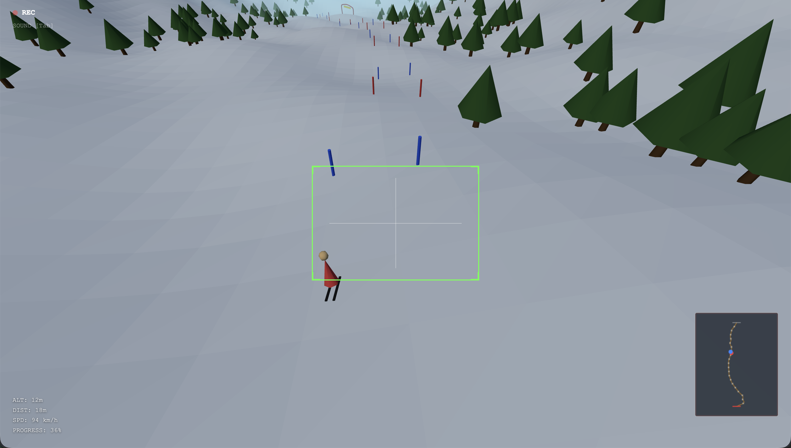

# Droneski

Browser game where you pilot an FPV camera drone filming a skier racing a
procedurally generated Olympic downhill course. Keep the skier in frame —
WASD + mouse, Tab to mute.



## Run locally

```bash
npm start          # static server on :3000 (or: npx serve .)
```

No build step: the app is plain ES modules with three.js vendored under
`vendor/` (same pattern as `life-lab/`).

## Test

```bash
npm test
```

## Refresh vendored three.js

After bumping `three` in `package.json`:

```bash
npm install
npm run vendor
```

## Controls

| Key | Action |
|-----|--------|
| W | Throttle |
| S | Cut engines |
| A / D | Roll |
| Mouse | Pitch & yaw (pointer lock) |
| Tab | Mute drone audio |

## History

Moved from [imjasonh/droneski](https://github.com/imjasonh/droneski) into this
playground monorepo so it deploys with the other browser apps (no Vite build at
publish time).
