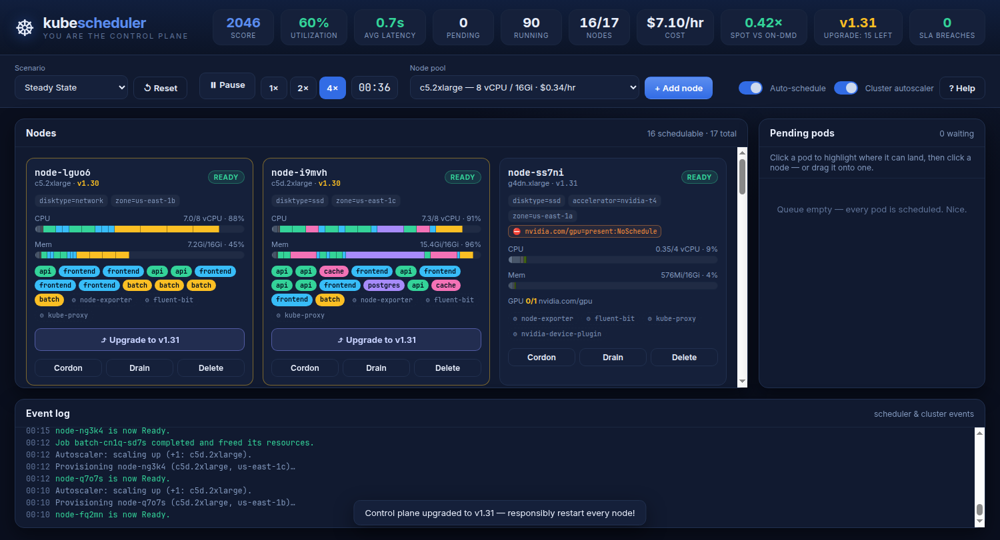

# kubescheduler — the game

A browser game where you are the Kubernetes scheduler and the cluster
operator. Pods stream into the cluster and you must bind each one to a node
that satisfies its constraints — resource requests, `nodeSelector`s,
taints/tolerations, and pod anti-affinity — while deciding when to provision
new nodes and when to cordon, drain, and terminate the ones you no longer need.
Your score rewards low scheduling latency and high utilization, and punishes
wasted spend, SLA breaches, and disruptive evictions.

You'll also handle the things that make running a real cluster hard: DaemonSets
that put per-node overhead on every machine, spot nodes that are cheap at a
fluctuating price but get reclaimed without warning, and Kubernetes version
upgrades that force you to restart every node without dropping workloads.



The app is a static site with zero runtime dependencies (vanilla ES modules, no
framework, no build step).

## Run locally

```bash
npm start
```

Then open <http://localhost:3000>. A static server is required because browsers
won't load native ES modules over `file://`.

Run the game-engine tests with:

```bash
npm test
```

## How to play

1. Click a pending pod in the queue to select it. Every node that can host it
   lights up green; nodes that can't are dimmed and show the blocking reason
   (for example, insufficient memory, an untolerated taint, or a failed
   selector match).
2. Click a green node — or drag the pod onto it — to bind it.
3. Or press **⚡** on a pod to auto-place just that one on its best-fit node.

Keep the queue empty, keep nodes busy, and don't overspend.

### Constraints

These match what real `kube-scheduler` enforces:

| Constraint | Meaning in the game |
| --- | --- |
| **Resource requests** | A pod's CPU / memory / GPU requests must fit in the node's free capacity. |
| **nodeSelector** | The node must carry the required label, for example `disktype=ssd`. |
| **Taints and tolerations** | A node's `NoSchedule` taint (`nvidia.com/gpu`, `spot`) blocks pods that don't tolerate it. |
| **Pod anti-affinity (hard)** | Two replicas of the same app may not share a node (used by `postgres`). |
| **Pod anti-affinity (soft / spread)** | The scheduler prefers to spread replicas across nodes (used by `frontend`/`api`); influences scoring, never blocks. |
| **Cordon / not-ready** | Cordoned or still-booting nodes won't accept new pods. |

### Curveballs

- **DaemonSets** — the controller automatically runs node agents
  (`node-exporter`, `fluent-bit`, `kube-proxy`, and a GPU `nvidia-device-plugin`
  on GPU nodes) on every matching node. They tolerate every taint, can't be
  moved, and consume capacity everywhere — so they're per-node overhead that
  rewards running fewer, larger nodes.
- **Spot nodes** — spot `c5.xlarge`/`c5.2xlarge` cost a fraction of on-demand,
  but they're billed at a fluctuating spot price and the cloud can reclaim them
  at any time. You get a brief **Reclaiming** countdown to drain them
  gracefully; if you don't, their pods are evicted back to the queue. Only put
  fault-tolerant work (for example, `batch`) on spot.
- **Cluster upgrades** — every so often the control plane jumps a minor version
  and every node falls behind. Restart them responsibly — a few at a time —
  using each node's **Upgrade** button. Out-of-date nodes bleed score until the
  rollout finishes, and completing the whole fleet pays a bonus.

### Operating the cluster

- **+ Add node** — provision capacity from a node pool. New nodes spend time
  **Provisioning** (and cost money the whole time) before they go **Ready**.
- **Cordon** — mark a node unschedulable without disturbing its running pods.
- **Drain** — cordon and gracefully evict its workload pods back to the queue
  (small penalty); DaemonSet pods stay put.
- **Upgrade** — appears on out-of-date nodes: drains then reboots the node onto
  the current Kubernetes version.
- **Delete** — terminate a node. Any pods still on it are force-killed (big
  penalty) — so drain first.

Turn on **Auto-schedule** and **Cluster autoscaler** to watch a baseline policy
play, then turn them off and try to beat it by hand.

## Scenarios

| Scenario | Description |
| --- | --- |
| **Steady State** | Balanced, predictable workload. Good for learning. |
| **Traffic Spike** | Calm baseline punctuated by big `frontend`/`api` surges. |
| **GPU Crunch** | Steady services plus periodic ML training jobs that demand GPU nodes. |
| **Production Chaos** | Everything at once, high churn across every workload type. |

## Project layout

```
kubescheduler-the-game/
├── index.html
├── styles.css
├── src/
│   ├── types.js       # instance types, app templates, units
│   ├── scheduler.js   # predicate filtering + scoring (pure, unit-tested)
│   ├── workload.js    # seeded PRNG, scenarios, pod generator
│   ├── engine.js      # game state, tick loop, scoring, autopilot
│   ├── ui.js          # DOM rendering + click/drag interaction
│   └── main.js        # boots the engine + UI and drives the clock
└── tests/
    └── scheduler.test.js
```

The simulation core (`types`, `scheduler`, `workload`, `engine`) is
UI-agnostic and pure where it counts, so it can be unit-tested under Node
without a browser.
