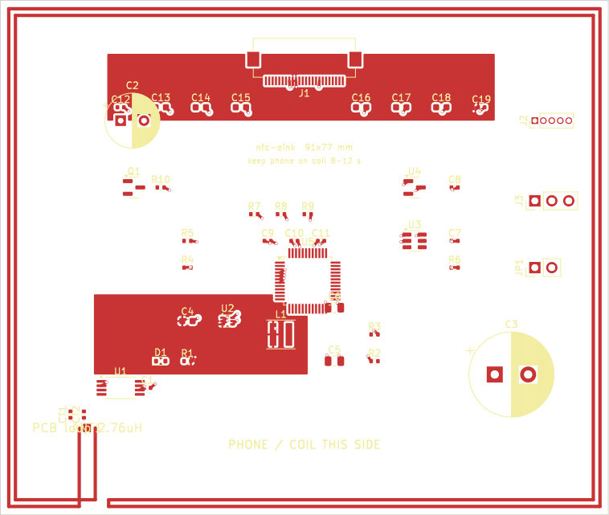
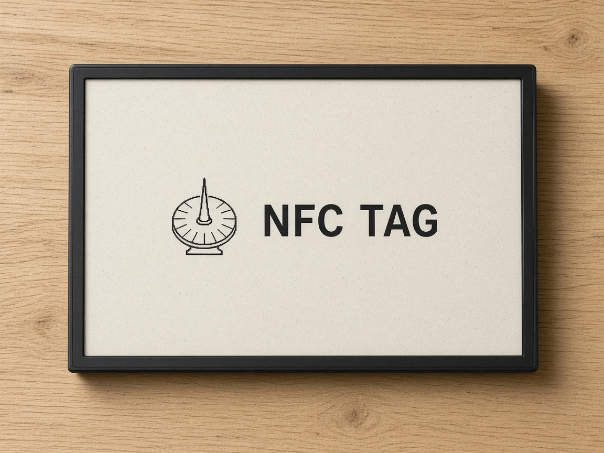
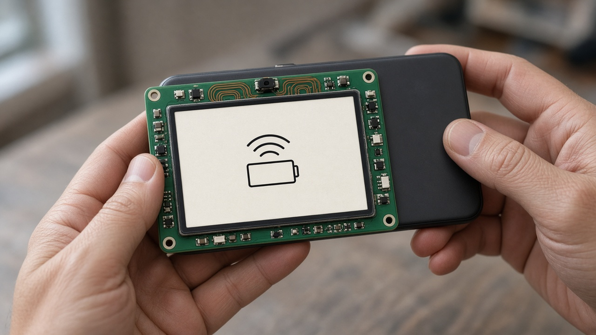
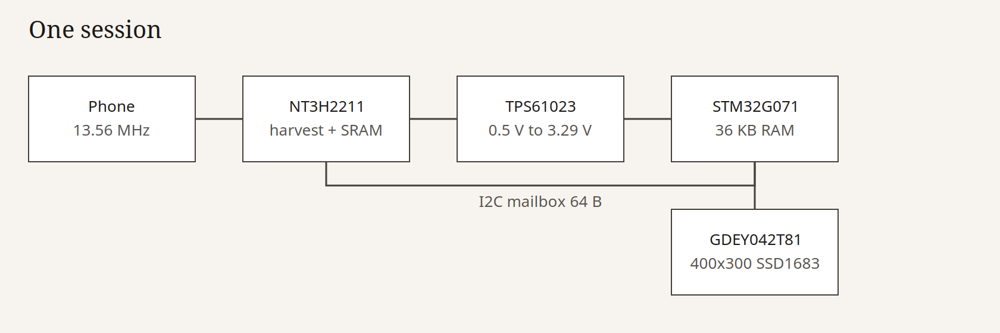
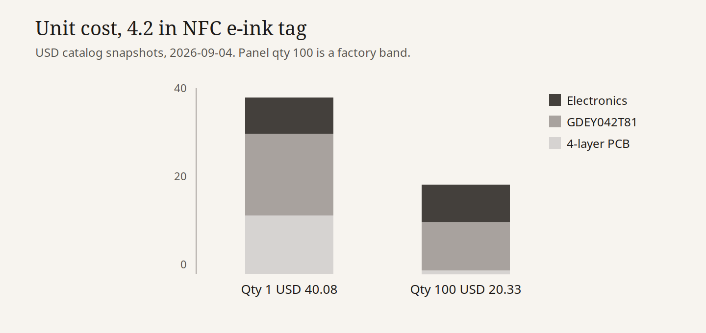

# NFC batteryless e-ink tag

A phone field powers this board. There is no battery. The MCU boots, pulls a
1-bit image out of the tag over I2C, paints a 4.2 in panel, and dies when you
take the phone away.

I sized this for the largest panel I trust on harvested NFC: Good Display
GDEY042T81 (400×300, 91 mm × 77 mm). Commercial batteryless NFC e-paper stops
around this diagonal. A 7.5 in 800×480 frame is 48 KB and a long refresh. The
field cannot cover that without a hold-up cap that takes too long to charge.

The board outline matches the panel. The 2-turn coil and the parts sit on the
phone side (`F.Cu`). The glass glues to the other side. Keep the phone on the
coil until the panel finishes.



The red ring is the 2-turn harvest loop. Parts live in the inner island. J1
is the 24-pin FPC on the long edge. C3 is the DNP supercap footprint.



The glass hides the copper. That photo is a mockup. The real outline is the
panel itself, 91 mm x 77 mm, not a thick plastic frame.



Keep the phone on the coil for 8 to 12 s. The mockup shows the picture side
for scale. On the real board the phone taps the parts side, opposite the
glass. The coil in that photo is also wrong. Trust the KiCad plot.




`B.Cu` is a GND island plus that silk line. Glue the GDEY042T81 here. Fold
the 24-pin FPC around the long edge to J1.



## Recommended design

| Role | Part | Why |
| --- | --- | --- |
| NFC + harvest | NXP NT3H2211W0FTTJ | ISO 14443-A. Faster than ST25DV (ISO 15693). About 15 mW in a strong phone field. 2 KB EEPROM, so the image must stream through the 64-byte SRAM mailbox. |
| MCU | STM32G071CBT6 | 36 KB RAM holds the 15 000-byte frame plus stack. HSI, no crystal. |
| Boost | TPS61023DRLR | Starts at 0.5 V. 3.29 V from 453 k / 100 k on FB. |
| EPD switch | TPS22917DBVR | Panel stays off until the tank and image are ready. |
| Reset | TCM809SENB713 | 2.93 V, active-low. Holds PF2-NRST until the boost is up. Do not use the J suffix (4.00 V). That part never releases on a 3.3 V rail. |
| Panel | GDEY042T81 | SSD1683, 24-pin 0.5 mm FPC, on-glass booster. Typical refresh about 5.6 mA at 3.0 V for about 3 s. |

Open `nfc-eink.kicad_pro` in KiCad 7. Sheets: cover, NFC, power, MCU, e-paper.
`nfc-eink.kicad_pcb` is the 91 mm × 77 mm 4-layer board. `nfc-eink.pdf` is the
schematic. Copper plots live in `plots/`.

## How a session runs

1. Place the phone on the coil. Keep it there until the panel finishes.
2. NT3H2211 VOUT charges C2 (470 µF) through D1 and R1 (22 Ω). C1 on VOUT is
   220 nF. NXP caps that pin at 220 nF. Do not add bulk there.
3. TPS61023 starts near 0.5 V and regulates 3.29 V.
4. TCM809 releases PF2-NRST (LQFP48 pin 10). The G071 has no dedicated NRST pin
   on this package.
5. Firmware enables harvest in the tag config if it is not already on, then
   drains the SRAM mailbox over I2C1 (PB6/PB7).
6. When the 15 000-byte frame is in RAM and `VSTORE_DIV` looks healthy, the MCU
   asserts `EPD_PWR_EN`, talks 4-wire SPI to the SSD1683, and waits on BUSY.
7. The MCU drops the EPD rail and waits in WFI. Remove the phone and the rails
   collapse. The image stays.

ISO 14443-A through the mailbox is about 40 kbit/s in practice, so the frame
takes about 3 s. Refresh is another 3 s. Budget 8 to 12 s of coupling.

## Power budget

Phone harvest is 15 to 20 mW when the coil is well coupled (NXP NTAG I2C plus
app note, ST AN4913 on ST25DV). That is the whole supply.

| Load | Draw | Notes |
| --- | --- | --- |
| STM32G071 at 16 MHz HSI | about 3 to 5 mA | Run slow. 64 MHz wastes harvest. |
| GDEY042T81 refresh | about 5.6 mA at 3.0 V, 3 s | Good Display typical. Peaks are higher when the glass DC-DC starts. |
| NTAG I2C + boost losses | 1 to 3 mA | Continuous while the field is present. |

C2 at 2 V stores about 1 mJ. That is a dip absorber, not the refresh energy.
The phone must stay on the coil. C3 (22 mF, DNP) is there if you want more
hold-up. It also adds several seconds of charge time.

R1 is 22 Ω so a 10 mA harvest current only drops 0.22 V into the tank. 470 Ω
would isolate VOUT from the empty cap, and it would also starve the boost once
the MCU and panel start drawing. 22 Ω is the compromise: short inrush, then
the field can keep feeding VSTORE.

## Cost at 1 and at 100

Yes, the unit price drops. The panel is still most of the bill.

| | Qty 1 | Qty 100 each |
| --- | --- | --- |
| Electronics (ICs, passives, inductor, FPC, headers) | $13.58 | $8.48 |
| GDEY042T81 panel | $18.50 | $11.00 |
| 4-layer PCB 91×77 mm | $8.00 | $0.85 |
| **Kit total** | **$40.08** | **$20.33** |

A hundred kits is about $2,033 in parts and bare boards before tax and
shipping. Figures are USD catalog snapshots on 2026-09-04. DigiKey and Mouser
move. DNP lines are $0.

The $11 panel is a Good Display factory band ($9 to $13 at 100). Buying ten
from LaskaKit or Waveshare stays near the $18 retail. Ask Good Display for a
real quote before you order a reel of everything else.

The PCB number uses JLCPCB's published 4-layer rate of about $70.60/m² on a
100-piece 100×100 mm example, scaled to 91×77 mm, plus a slice of setup and
ship. A single proto board from a Western fab is the $8 line.

That $20.33 is a kit you solder. JLCPCB SMT on this BOM is mostly Extended
library parts (NXP, ST, Coilcraft, Hirose), so feeder setup is real. Budget
about $4 to $8 extra per board at 100 if you do not want to place 0402s
yourself. A stuffed board is then about $24 to $28.

| Part | Qty 1 | Qty 100 |
| --- | --- | --- |
| GDEY042T81 | $18.50 | $11.00 |
| STM32G071CBT6 | $2.79 | $2.23 (ST store 100-249) |
| NT3H2211W0FTTJ | $1.18 | $0.76 |
| Hirose FH12-24S | $1.85 | $1.25 |
| Coilcraft XEL4030 | $1.15 | $0.88 |
| TPS61023DRLR | $1.31 | $0.64 |
| 4-layer PCB | $8.00 | $0.85 |

`bom.csv` has every line with buy links.

## PCB

4-layer, 91 mm × 77 mm, 1.6 mm FR4.

| Layer | Use |
| --- | --- |
| F.Cu | Coil, parts, phone side |
| In1.Cu | GND in the inner island |
| In2.Cu | +3V3 in the inner island |
| B.Cu | GND island. Silk says `PANEL THIS SIDE`. |

The coil is a 2-turn Class-1 loop, 0.5 mm trace, 0.5 mm gap, target 2.76 µH
with the chip's 50 pF. No pour under the turns. CT1 and CT2 are NP0 pads,
DNP until a VNA or a phone-range sweep.

`tools/gen_pcb.py` rebuilds the board from the footprint list. `tools/erc.py`
checks the schematic netlist. `tools/pcb_check.py` checks outline, required
footprints, and that each listed net has at least two pads. It is not KiCad
DRC. Open the board in Pcbnew and run DRC before you order.

```bash
python3 nfc-eink/tools/gen_pcb.py   # only if you change placement
bash nfc-eink/tools/validate.sh
bash nfc-eink/tools/plot_pcb.sh     # SVG + PDF in plots/
```

The FPC folds around the long edge to J1. Close JP1 only when an ST-Link
feeds J2 pin 1.

## Firmware

See [`firmware/README.md`](firmware/README.md). Host tests of the 64-byte
`EINK` mailbox and the 400×300 PBM packer:

```bash
make -C nfc-eink/firmware test
```

`make -C nfc-eink/firmware mcu` builds `nfc-eink.elf` when
`arm-none-eabi-gcc` is installed. Flash on J2.

## Alternate designs

These get close to the same goals. I would not schematic them first.

| Design | Display | Reliability | Transfer | Board size | Notes |
| --- | --- | --- | --- | --- | --- |
| **This board** | 4.2 in 400×300 | High if the phone stays put | Fastest ISO 14443-A mailbox | 91 × 77 mm | Recommended. |
| ST25DV64KC, same MCU and power | 4.2 in | Similar harvest, sometimes a bit more | Slower ISO 15693 | Same | 8 KB EEPROM is still too small for the frame. You still stream. |
| Good Display NFC-D4-042 (FM1280) | 4.2 in | High on supported phones | Module-defined | Module-sized | Buy it if you want a known-good radio. The IC is not on DigiKey. The app is theirs. Phone coverage is uneven. |
| Same board, GDEY0213B74 | 2.13 in 250×122 | Highest | Fast (about 4 KB) | Smaller than 4.2 in | Best if you care more about first-try success than pixels. |
| STM32G0B1 + 0.047 F + 5.83 in | 5.83 in 648×480 | Low | 39 KB, long hold | Larger than I want | 15 to 30 s on the coil. Brownouts are common. |
| 7.5 in 800×480 | 7.5 in | Poor | 48 KB | Panel-sized | I would not ship this batteryless. Use a coin cell or keep inkbot's USB path. |
| ams AS3956 Type 4 | 4.2 in | High | Type 4, you write the app | Same | Regulated harvest, nicer analog, more money, harder phone code. |
| Infineon NGC1081 | any | n/a | n/a | n/a | End of life. Skip it. |
| STM32U031 in place of G071 | 2.13 in only | High on small glass | Fine | Smaller | 12 KB RAM cannot hold a 4.2 in frame. |

If two rows look tied, pick this board or the 2.13 in variant. The FM1280
module is the "I do not want to tune an antenna" option.

## Schematic, board, firmware

| File | What it is |
| --- | --- |
| `nfc-eink.kicad_pro` | KiCad 7 project |
| `nfc-eink.kicad_sch` | Cover sheet with the four children |
| `nfc.kicad_sch` | Antenna, NT3H2211, 220 nF on VOUT |
| `pwr.kicad_sch` | Diode, tank, boost, EPD load switch, reset |
| `mcu.kicad_sch` | STM32G071, SWD, UART, I2C pull-ups |
| `epd.kicad_sch` | FH12-24S, SSD1683 host caps, 2N7002 booster FET |
| `nfc-eink.kicad_pcb` | 4-layer 91×77 mm layout |
| `nfc-eink.pdf` | Plotted schematic |
| `plots/` | Copper and silk SVG / PDF |
| `firmware/` | G071 sources + host tests |
| `bom.csv` | Qty-1 and qty-100 USD |

`tools/gen_schematic.py` rebuilds the `.kicad_sch` files. Run it only when you
change the generator. Then run ERC again.

### Validate

```bash
# Debian/Ubuntu
sudo apt-get install -y kicad
bash nfc-eink/tools/validate.sh
```

The schematic checker allows no-connects on unused G071 GPIO and on EPD pins
1, 4, 6, 7, and 19. Anything else unconnected fails the run.

## MCU map

| Net | G071 pin | Ball |
| --- | --- | --- |
| NRST | 10 | PF2-NRST |
| VSTORE_DIV | 11 | PA0 (ADC) |
| DBG_TX / DBG_RX | 13 / 14 | PA2 / PA3 |
| EPD_CS / SCK / BUSY / MOSI | 15 / 16 / 17 / 18 | PA4 / PA5 / PA6 / PA7 |
| EPD_PWR_EN | 19 | PB0 |
| EPD_DC | 28 | PA8 |
| SWDIO / SWCLK | 35 / 36 | PA13 / PA14 |
| EPD_RST | 37 | PA15 |
| NFC_FD | 44 | PB5 |
| I2C_SCL / I2C_SDA | 45 / 46 | PB6 / PB7 |
| VBAT, VREF+, VDD | 4, 5, 6 | tie to +3V3 |
| VSS | 7 | GND |

J2 is 1.27 mm, 3V3 / SWDIO / SWCLK / NRST / GND. Close JP1 only when an
ST-Link feeds J2 pin 1. Leave it open for NFC power.

## Antenna and layout

Target L is 2.76 µH with the chip's 50 pF:

`L = 1 / (4π² f² C)` at 13.56 MHz.

The generator draws a 2-turn loop in the 91 mm × 77 mm bezel. 0.5 mm trace,
0.5 mm gap, no copper pour in the keepout, no ground under the turns. CT1 /
CT2 are NP0 pads. Leave them DNP until a VNA or a phone-range sweep says you
need 15 pF or 27 pF.

Keep D1, R1, and C2 tight to U1. Keep L1, C5, and C6 tight to U2. The FPC
connector sits on the long edge of the panel.

The e-ink backplane is metal. Putting the coil under the glass kills it. That
is why the phone taps the parts side, not the picture side.

## What is not in this tree

No phone app. `firmware/host/pack_pbm` builds the 235-chunk file. You still
need something on the phone that writes NTAG SRAM. NXP's NTAG I2C plus demo
is the usual starting point.
