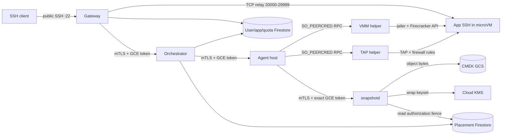
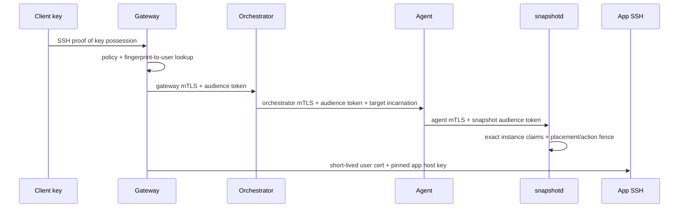
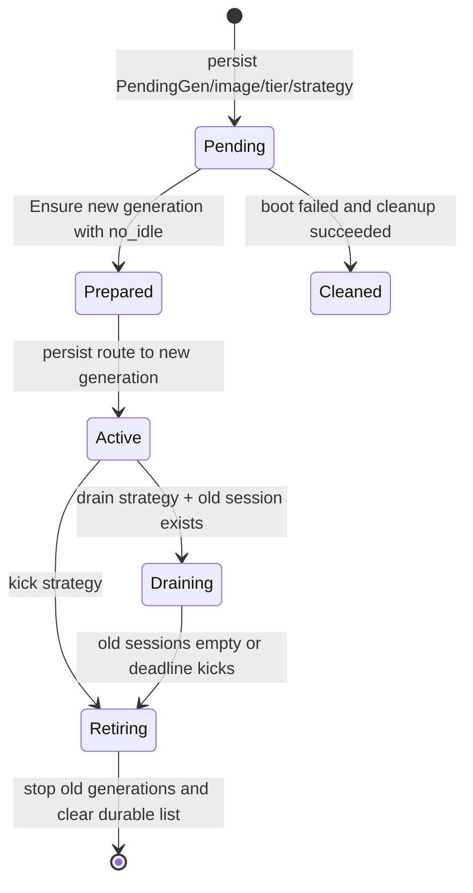

# sshcloud implementation design

This document describes the implementation in `sshcloud/` as it exists in this
tree. It is the code-oriented companion to the product design in
[`../docs/ssh-app-cloud-design.md`](../docs/ssh-app-cloud-design.md). The
product document explains intended behavior and product choices; this document
records executable boundaries, persistent state, protocols, recovery rules,
and known gaps.

Source code and Terraform remain authoritative. This document intentionally
does not duplicate every command-line default or resource attribute. Follow
the linked source when changing a contract, and update this document when a
boundary or invariant changes.

## Verification legend

The status labels used below are deliberately separate:

| Label | Meaning |
|---|---|
| **I** | Implemented and wired into a runnable command. |
| **A** | Covered by automated unit, integration, emulator, or fault-injection tests. |
| **K** | Exercised with a real Firecracker process under the explicit direct KVM test runtime. |
| **S** | Checked structurally, such as Terraform text/validation or a fixed command/ruleset test; the substrate is not exercised. |
| **G** | Behavior depends on a deployed GCP substrate and still requires an operator-owned manual verification. |

`G` means “manual verification required,” not “verified.” Local object-store,
KMS, metadata-token, Firestore, and systemd fakes do not prove provider or
kernel semantics.

## 1. System shape and ownership



The principal ownership rules are:

| State or capability | Sole writer/owner in production | Readers/clients | Invariant |
|---|---|---|---|
| Public SSH connection and outer session | Gateway | SSH client | No host shell and no arbitrary SSH channel forwarding. |
| User, key, and app records | Gateway | Gateway; orchestrator only for quota counters | App namespace is scoped by registered user. |
| Placement, lease, and operation journal | Orchestrator | Orchestrator; snapshotd read-only | One app has one revisioned placement record and at most one live mutation lease. |
| Firecracker instance inventory | Agent on the placed host | Orchestrator | A mutation is bound to the host's immutable GCE instance name and ID. |
| Privileged VMM lifecycle | Root VMM helper | Unprivileged agent over a private socket | Requesters cannot select executables, host paths, UIDs, GIDs, or cgroup knobs. |
| TAP and host firewall mutation | `sshcloud-tap` helper with only `CAP_NET_ADMIN` | Unprivileged agent over a private socket | Requesters supply only a VM ID and validated host IP. |
| Durable snapshot object and KEK access | snapshotd service account | Agents through snapshotd | Agents have no direct snapshot bucket or KMS grant. |
| User certificate signing | Gateway | Apps trust injected public CA | A short-lived certificate principal is the registered platform user. |
| App host identity | Agent creates and injects per generation | Gateway pins public key from control-plane result | Gateway-to-app SSH never accepts an unpinned host key. |
| Access policy | Terraform/operator publishes; gateway host refreshes | Gateway | Production admissions fail closed when no fresh validated policy exists. |

The production topology is single-region, one gateway VM, one orchestrator VM,
one private snapshotd VM, and a zonal nested-virtualization agent MIG. It is not
an HA gateway design. See
[`terraform/{gateway,orchestrator,snapshotd,agents}.tf`](terraform/).

## 2. Executables

### Commands

| Command | Responsibility and boundary | Main sources | Verification |
|---|---|---|---|
| `cmd/gateway` | Public SSH server; access policy, join/menu/deploy, session admission, user-cert minting, app proxying, deploy cutover, and the orchestrator-only migration listener. Selects memory or Firestore state and local-agent, orchestrator, or process backends. | [`cmd/gateway/main.go`](cmd/gateway/main.go), `internal/{sshd,gateway,cutover,session}` | I, A; deployed identity/network path G |
| `cmd/orchestrator` | Placement-aware gateway API, root-only admin API, host discovery/reload, quota-aware best-fit scheduling, migration, drain, and expired-journal reconciliation. | [`cmd/orchestrator/main.go`](cmd/orchestrator/main.go), [`routes.go`](cmd/orchestrator/routes.go), [`hosts.go`](cmd/orchestrator/hosts.go), [`http_helpers.go`](cmd/orchestrator/http_helpers.go), `internal/{backend,migrate,drain,reconcile,placement}` | I, A; Firestore/Compute and deployed control path G |
| `cmd/agent` | Unprivileged per-host instance manager and authenticated HTTP API. Materializes OCI rootfs images, owns local inventory/idle loop/relays, and delegates privileged work to helpers in production. | [`cmd/agent/main.go`](cmd/agent/main.go), `internal/agent` | I, A, K; production helper path G |
| `cmd/snapshotd` | Private authenticated snapshot proxy. It is the only runtime principal with snapshot GCS and envelope-KEK permissions; validates archive/layout, placement fences, staging bounds, encryption, and publication. | [`cmd/snapshotd/main.go`](cmd/snapshotd/main.go), `internal/{snapshotd,snapshot}` | I, A; GCS/KMS/CMEK/IAM G |
| `cmd/vmmhelper` | Root-owned, socket-activated Firecracker+jailer lifecycle boundary, fixed asset staging, cgroup-v2 enforcement, API proxy, snapshot export, orphan cleanup, and loopback aggregate metrics. | [`cmd/vmmhelper/main.go`](cmd/vmmhelper/main.go), `internal/vmmhelper` | I, A, S; deployed jailer/cgroup/systemd G |
| `cmd/taphelper` | Separate socket-activated network helper running as `sshcloud-tap` with only `CAP_NET_ADMIN`; creates/deletes deterministic TAPs and deny-by-default IPv4/IPv6 rules. | [`cmd/taphelper/main.go`](cmd/taphelper/main.go), `internal/taphelper` | I, A, S; deployed capability/netfilter behavior G |
| `cmd/guestinit` | Injected guest PID 1. Loads `/platform-boot.json`, mounts the supported pseudo-filesystems, changes working directory, and `exec`s OCI Entrypoint+Cmd with the configured environment. | [`cmd/guestinit/main.go`](cmd/guestinit/main.go), [`internal/guestinit/spec.go`](internal/guestinit/spec.go) | I, A, K |
| `cmd/fortune` | Sample SSH app. Trusts the platform user CA, requires the injected Ed25519 host key, accepts session shell/exec, and prints a fortune. It is deployed as an ordinary digest-pinned image. | [`cmd/fortune/main.go`](cmd/fortune/main.go) | I, A, K |
| `cmd/ocirootfs` | Developer CLI around OCI image materialization; prints the cached ext4 path and optionally its boot spec. Not a service. | [`cmd/ocirootfs/main.go`](cmd/ocirootfs/main.go), `internal/ocirootfs` | I, A |
| `cmd/mkrootfs` | Offline test/dev builder for a fortune ext4 image and adjacent boot spec. It is not the normal deploy path. | [`cmd/mkrootfs/main.go`](cmd/mkrootfs/main.go), `internal/rootfs` | I, A |
| `hack/genuca` | Generates the platform user-CA keypair used by the KVM fixture. It delegates key format and permissions to `internal/userca`. | [`hack/genuca/main.go`](hack/genuca/main.go) | I, K indirectly |

The production platform-service commands install the structured JSON sink at startup.
Operational options are registered in each `main.go`; only boundary-defining
options are called out in this document.

### Internal package inventory

Every `internal/*` package is represented here. “Tests” describes the strongest
checked-in coverage, not a production-readiness claim.

| Package | Owned responsibility | Important sources | Tests |
|---|---|---|---|
| `access` | Immutable SSH-key policy, strict JSON parser, file reload, and last-known-good lease. | [`internal/access/policy.go`](internal/access/policy.go) | Unit |
| `agent` | Instance state machine, capacity reservations, cold boot, sleep/wake, adopt/evict, idle/no-idle, relay, HTTP API, and direct/helper runtimes. | [`manager.go`](internal/agent/manager.go), [`http.go`](internal/agent/http.go), [`runtime.go`](internal/agent/runtime.go), [`helper_runtime.go`](internal/agent/helper_runtime.go), [`relay.go`](internal/agent/relay.go) | Unit, fault injection, KVM |
| `apppack` | Creates a minimal OCI image from a Linux binary for tests and demos. | [`internal/apppack/pack.go`](internal/apppack/pack.go) | Unit/integration |
| `backend` | Authenticated clients for agent, orchestrator, and gateway; mutable host set; placement-aware scheduler; local fortune backend; GCE tombstone checks. | [`controlhttp.go`](internal/backend/controlhttp.go), [`agent.go`](internal/backend/agent.go), [`orchestrator.go`](internal/backend/orchestrator.go), [`gateway.go`](internal/backend/gateway.go), [`placed.go`](internal/backend/placed.go), [`hosts.go`](internal/backend/hosts.go), [`tombstone.go`](internal/backend/tombstone.go), [`local.go`](internal/backend/local.go) | Unit/httptest |
| `controlauth` | TLS 1.3 role certificates, dynamic A/B trust reload, GCE identity-token mint/verify, exact caller policies, and loopback-only insecure mode. | [`auth.go`](internal/controlauth/auth.go), [`tls.go`](internal/controlauth/tls.go), [`flags.go`](internal/controlauth/flags.go) | Unit/TLS integration |
| `cutover` | Process-local serialized deploy transaction, pending/active/draining/retiring generations, kick/drain behavior, timers, and restart reconciliation. | [`internal/cutover/cutover.go`](internal/cutover/cutover.go) | Unit, SSH e2e, fault injection |
| `drain` | Cordon and multi-generation app movement off a host, target capacity reservation, rollback, and per-app durable journals. | [`internal/drain/drain.go`](internal/drain/drain.go) | Unit/httptest |
| `firecracker` | Direct Firecracker process/API client, cold configuration, pause/resume, snapshot create/load, direct TAP setup, and readiness probing. | [`client.go`](internal/firecracker/client.go), [`snapshot.go`](internal/firecracker/snapshot.go), [`tap.go`](internal/firecracker/tap.go) | Unit, KVM |
| `firestoredb` | Shared project/database/prefix validation and Firestore client lifecycle. | [`internal/firestoredb/firestore.go`](internal/firestoredb/firestore.go) | Unit |
| `gateway` | Hub admission/routing, access checks, join/menu/deploy UI and exec modes, proxy, loading/retry, migration control/buffer, session contract, and quotas. | [`hub.go`](internal/gateway/hub.go), [`proxy.go`](internal/gateway/proxy.go), [`deploy.go`](internal/gateway/deploy.go), [`control.go`](internal/gateway/control.go), [`session_spec.go`](internal/gateway/session_spec.go) | Unit, SSH integration/e2e |
| `genid` | Opaque generation IDs and collision-free `app.gen` agent names. | [`internal/genid/gen.go`](internal/genid/gen.go) | Unit |
| `guestinit` | Validated JSON boot spec, adjacent spec paths, guest mounts, and final process exec. | [`internal/guestinit/spec.go`](internal/guestinit/spec.go) | Unit, KVM |
| `healthhttp` | Standard bounded health server exposing `livez`, `readyz`, `healthz`, and aggregate `metrics`. | [`internal/healthhttp/health.go`](internal/healthhttp/health.go) | Exercised by service tests |
| `helperrpc` | One-request strict JSON protocol, size/deadline bounds, systemd socket activation, and authoritative Linux `SO_PEERCRED` UID checks. | [`internal/helperrpc/rpc.go`](internal/helperrpc/rpc.go) | Unit/Unix-socket integration |
| `hostisolation` | Fixed Firecracker version/layout, deterministic VM/TAP/sandbox IDs, safe work paths, and host-IP constraints. | [`internal/hostisolation/layout.go`](internal/hostisolation/layout.go) | Unit, Terraform structural |
| `hostkey` | Atomic Ed25519 SSH host-key generation/loading with private permissions. Used by the gateway, per-app injection, and the local sample app path. | [`internal/hostkey/hostkey.go`](internal/hostkey/hostkey.go) | Unit |
| `image` | Digest pinning and operator registry-host allowlist; rejects tags and arbitrary registry SSRF targets. | [`internal/image/ref.go`](internal/image/ref.go) | Unit |
| `migrate` | One-generation cross-host freeze, sleep, evict, adopt, placement commit, thaw, and rollback. | [`internal/migrate/migrate.go`](internal/migrate/migrate.go) | Unit/httptest, KVM primitive path |
| `names` | Owner/app identifier syntax and reserved platform SSH usernames. | [`internal/names/names.go`](internal/names/names.go) | Unit |
| `observability` | Privacy-safe event schemas, JSON logging, bounded app/diagnostic console drains, strict app telemetry, and tenant-free aggregate metrics. | [`events.go`](internal/observability/events.go), [`console.go`](internal/observability/console.go), [`metrics.go`](internal/observability/metrics.go), [`log.go`](internal/observability/log.go) | Unit, privacy sentinels, Terraform structural |
| `ocirootfs` | Authenticated OCI pull, whiteout-aware safe unpack, ext4 materialization, boot-spec derivation, and bounded digest cache. | [`ocirootfs.go`](internal/ocirootfs/ocirootfs.go), [`unpack.go`](internal/ocirootfs/unpack.go), [`cache.go`](internal/ocirootfs/cache.go) | Unit/integration |
| `placement` | Durable app placement schema, transactional CAS, expiring lease guard/heartbeat, operation journal, and memory/Firestore stores. | [`placement.go`](internal/placement/placement.go), [`lease.go`](internal/placement/lease.go), [`firestore.go`](internal/placement/firestore.go) | Unit, Firestore emulator |
| `quota` | Idempotent rolling-window counters, memory/Firestore stores, and per-IP handshake limiter. | [`quota.go`](internal/quota/quota.go), [`firestore.go`](internal/quota/firestore.go), [`ip.go`](internal/quota/ip.go) | Unit, Firestore emulator |
| `reconcile` | Recovery of expired ensure, stop, migrate, and drain journals using participant inventory and immutable host tombstones. | [`internal/reconcile/reconcile.go`](internal/reconcile/reconcile.go) | Fault-injection unit tests |
| `rootfs` | ext4 construction and file injection through `mkfs.ext4`/`debugfs`; fortune fixture builder. | [`internal/rootfs/build.go`](internal/rootfs/build.go) | Unit/tool-dependent |
| `route` | Pure SSH username/key/app routing decision. | [`internal/route/route.go`](internal/route/route.go) | Unit |
| `session` | In-memory admitted-session registry, per-user/per-generation bounds, cancel/kick, and exact-session freeze/thaw commands. | [`internal/session/session.go`](internal/session/session.go) | Unit, SSH e2e |
| `snapshot` | Structured references, fixed archive, local/remote stores, GCS object CAS, Tink envelope format, and Cloud KMS wrapper. | [`store.go`](internal/snapshot/store.go), [`archive.go`](internal/snapshot/archive.go), [`envelope.go`](internal/snapshot/envelope.go), [`objects.go`](internal/snapshot/objects.go), [`remote.go`](internal/snapshot/remote.go), [`local.go`](internal/snapshot/local.go), [`kms.go`](internal/snapshot/kms.go) | Unit/fake object store, KVM local store |
| `snapshotd` | HTTP data plane, exact placement/action authorization fence, and weighted staging guard. | [`http.go`](internal/snapshotd/http.go), [`authorize.go`](internal/snapshotd/authorize.go), [`staging.go`](internal/snapshotd/staging.go) | Unit/httptest |
| `sshd` | Public SSH transport, handshake/channel limits, session request parsing, policy recheck, and dispatch into the hub. | [`internal/sshd/server.go`](internal/sshd/server.go) | Real SSH client integration/e2e |
| `store` | User/key/app persistence contract plus memory and Firestore implementations. | [`store.go`](internal/store/store.go), [`memory.go`](internal/store/memory.go), [`firestore.go`](internal/store/firestore.go) | Conformance, Firestore emulator |
| `taphelper` | Client/server for deterministic TAP ownership and netfilter policy. | [`client.go`](internal/taphelper/client.go), [`server.go`](internal/taphelper/server.go) | Unit/command fake, structural |
| `userca` | Ed25519 platform user CA and short-lived per-attach SSH certificates. | [`internal/userca/ca.go`](internal/userca/ca.go) | Unit |
| `vmmhelper` | Client/server for pinned jailed VMM lifecycle, file staging/export, cgroups, peer-authenticated API proxy, and termination proof. | [`client.go`](internal/vmmhelper/client.go), [`server.go`](internal/vmmhelper/server.go) | Unit/syscall fakes, structural |

## 3. Protocols and listeners

### Public SSH

The public listener is implemented by `internal/sshd` and is normally bound by
the gateway to TCP `:22`. The SSH handshake proves possession of the offered
public key; the server stores its SHA-256 fingerprint in connection
permissions. Policy and registration authorization happen in `gateway.Hub`
after transport authentication.

Only `session` channels are accepted. Global requests are discarded. TCP/IP
forwarding, reverse forwarding, agent forwarding, and arbitrary channel types
are not implemented.

| SSH username and state | Result |
|---|---|
| Any username, admitted but unknown key | Join |
| `join`, known key | Limited identity display; no add/list/revoke implementation |
| `deploy`, known authorized deployer | Deploy UI or strict exec-argument deploy |
| `menu` or empty username, known key | Interactive menu |
| Existing app name, known owner key | Direct app session |
| Unknown or reserved name, known key | Menu fallback |
| Key denied by current access policy | Forbidden before route mutation |

One session channel accepts bounded setup requests followed by exactly one
start request:

| Request | Handling |
|---|---|
| `pty-req`, `env` | Validated and retained byte-for-byte before start; forwarded in order to the app. |
| `window-change` | Forwarded after start; latest declarative size is retained across a migration reconnect. |
| `signal` | Forwarded only while attached. It is not replayed to a replacement process. |
| `shell`, `exec`, `subsystem` | Exactly one starts the session. Platform join/deploy reject subsystem; menu requires shell. |
| App `exit-status`, `exit-signal` | Payload is forwarded back exactly; stderr remains separate. |

The gateway mints a five-minute SSH user certificate for an ephemeral key,
dials the target with only the pinned Ed25519 host key, opens one backend
`session` channel, and forwards the declared contract. Only a shell with a PTY
is migratable. Exec, subsystem, and non-PTY sessions are disconnected during
host movement rather than replayed. Sources:
[`internal/sshd/server.go`](internal/sshd/server.go),
[`internal/gateway/proxy.go`](internal/gateway/proxy.go), and
[`internal/gateway/session_spec.go`](internal/gateway/session_spec.go).

`cmd/fortune` is the checked-in example of the app-side SSH contract, not an
additional platform route. It authenticates only certificates from the
injected user CA, accepts only `session` channels, acknowledges
`pty-req`/`env`/`window-change`, and starts on `shell` or `exec`; other
requests are rejected. Real applications may implement the broader supported
session contract above.

Host administration is a separate ordinary Debian SSH service reached through
IAP. The gateway startup moves it to port 2222 so the platform gateway can own
port 22; orchestrator, snapshotd, and agent hosts retain administrative SSH on
port 22. This path is not handled by `internal/sshd`.

### HTTP/HTTPS route inventory

Production control listeners use HTTPS with TLS 1.3 mTLS plus a per-request GCE
identity token. The explicit `-control-insecure-loopback` mode permits plaintext
only on loopback and is for local development.

| Listener | Routes | Caller |
|---|---|---|
| Gateway migration control | `POST /v1/sessions/freeze`, `POST /v1/sessions/thaw` | Orchestrator only |
| Orchestrator gateway-service | `GET /v1/readyz`, `POST /v1/ensure`, `POST /v1/stop`, `POST /v1/no-idle` | Gateway only |
| Orchestrator admin, HTTPS over root-owned Unix socket | `GET /v1/hosts`, `POST /v1/hosts/cordon`, `POST /v1/hosts/drain`, `POST /v1/migrate`, `GET /v1/placement`, `GET /v1/placements`, `GET /v1/diagnostics` | Orchestrator's own workload identity, invoked locally by an operator helper |
| Agent control | Routes listed below | Orchestrator only |
| snapshotd control | `GET /v1/healthz`, `PUT /v1/snapshots/package`, `POST /v1/snapshots/get`, `POST /v1/snapshots/has`, `POST /v1/snapshots/meta`, `POST /v1/snapshots/delete` | Agent only |
| VMM helper metrics | `GET /metrics` on a literal-loopback listener; the metrics handler rejects non-GET requests and has no tenant diagnostics | Local Ops Agent scrape only |

The snapshot protocol never accepts object names or signed URLs. `PUT
/v1/snapshots/package` carries one canonical base64url-encoded JSON `Ref` in
`X-Sshcloud-Snapshot-Ref` and a bounded
`application/vnd.sshcloud.snapshot+tar` body. The other snapshot methods carry
the strict structured `Ref` as their bounded JSON body; `get` returns the same
canonical tar media type, while `has` and `meta` return strict JSON. See
[`internal/snapshot/remote.go`](internal/snapshot/remote.go).

Agent control routes:

| Route | Semantics |
|---|---|
| `POST /v1/instances/ensure` | Return an existing compatible running instance, wake a sleeping one, or cold-boot `image`/`tier`; optionally hold `no_idle`. |
| `POST /v1/instances/stop` | Terminate and remove local and durable snapshot state for the generation. |
| `POST /v1/instances/sleep` | Pause, durably snapshot, prove VMM termination, retain TAP and sleeping inventory. |
| `POST /v1/instances/wake` | Restore an already registered sleeping generation. |
| `POST /v1/instances/evict` | Remove a sleeping generation's local TAP/workdir/inventory while retaining the shared snapshot. |
| `POST /v1/instances/adopt` | Restore a shared snapshot on this host; a cordon epoch permits forced rollback to a cordoned source. |
| `POST /v1/instances/preflight` | Validate snapshot identity/layout/platform compatibility without allocating a VM. |
| `POST /v1/instances/register-sleeping` | Reconstruct sleeping local inventory from a durable snapshot without waking it. |
| `POST /v1/instances/no-idle` | Set or clear the active-operation/session idle hold. |
| `GET /v1/instances/status?user=&app=&gen=` | Return one generation's authoritative local state. |
| `GET /v1/host/capacity` | Total, used, reserved resources and cordon state. |
| `GET /v1/host/instances` | Bounded control-plane inventory. |
| `GET /v1/host/orphans` | Validated work directories not represented in manager inventory. |
| `GET /v1/host/identity` | Return a fresh GCE token for the server-identity audience. |
| `POST /v1/host/cordon` | Reject new lifecycle reservations and return an opaque cordon epoch. |
| `POST /v1/host/uncordon` | Clear only the matching cordon epoch. |

Every production agent `POST` also requires exactly one
`X-SSHCloud-Target-Instance-Name` and
`X-SSHCloud-Target-Instance-ID`, matching the receiving VM. This prevents a
stale host-list entry from mutating a replacement instance with the same name.
The backend client verifies `/v1/host/identity` against the separately scoped
agent-server audience before placement commit.

Gateway, orchestrator, agent, and snapshotd expose a separate unauthenticated
health-only listener. Standard routes are `GET /livez`, `GET /readyz`,
`GET /healthz`, and `GET /metrics`. snapshotd additionally exposes
`GET /bounds`; it reports only aggregate staging limits/use. The TAP helper has
no HTTP listener. Health listeners do not expose placement or tenant
diagnostics.

The orchestrator's authenticated gateway listener also exposes
`GET /v1/readyz`; its admin Unix socket does not. snapshotd's authenticated
agent listener uses `GET /v1/healthz`, while host/operator checks use the
unprefixed health routes on port 8083.

Request bodies use bounded JSON decoders with unknown fields rejected.
`internal/backend/controlhttp.go` rejects redirects, oversized bodies, trailing
JSON, and non-loopback insecure URLs. Control errors are mapped to stable HTTP
classes: malformed input is 400, an agent mutation addressed to a stale
instance identity is 421, placement or capacity conflict is generally 409,
temporary unavailability is 503, and authorization failures are 401/403.

### Unix-socket protocols

| Socket | Protocol | Authentication and constraints |
|---|---|---|
| `/run/sshcloud/orchestrator-admin.sock` | HTTPS requests using the admin routes above | Root-owned mode `0600`; the production process must be root to create it. TLS still requires the orchestrator role leaf and a fresh admin-audience token. |
| `/run/sshcloud/vmmhelper.sock` | One strict JSON `helperrpc.Request` and one `Response` per connection | Socket mode is defense in depth; `SO_PEERCRED.uid` must equal the configured agent UID. Operations: `ready`, `launch`, `alive`, `kill`, `export-snapshot`. |
| `/run/sshcloud/taphelper.sock` | Same `helperrpc` envelope | Exact agent UID via `SO_PEERCRED`. Operations: `ready`, `create`, `delete`. |
| Per-VM VMM API proxy | Firecracker HTTP API over Unix socket | Agent connects to a helper-created proxy. Upstream jailed Firecracker socket must be owned by the deterministic sandbox UID; the proxy authenticates that peer before copying bytes. |
| Direct-runtime `<per-VM-work-dir>/firecracker.sock` | Firecracker HTTP API over Unix socket | Local/KVM mode only. The agent starts Firecracker itself, so the production helper proxy and sandbox-peer check are absent. |

`helperrpc` has one JSON value, no unknown fields or trailing data, a 64 KiB
message bound, connection/operation deadlines, and a new authenticated
connection per operation. A VMM launch request can select only the deterministic
VM ID, `cold|restore`, one supported tier's vCPU/memory pair, and validated log
identity. A TAP request can select only deterministic VM ID and validated host
IP.

The Firecracker API calls made by `internal/firecracker` are:
`PUT /machine-config`, `/boot-source`, `/drives/1`,
`/network-interfaces/eth0`, and `/actions`; `PATCH /vm` for pause/resume;
`PUT /snapshot/create`; and `PUT /snapshot/load`. Production path arguments
inside the jail are fixed by `internal/hostisolation`, not by an HTTP caller.

## 4. Authentication, authorization, and access modes

### Identity hops



There are four control-certificate roles and exact URI SANs:

| Role | URI |
|---|---|
| gateway | `spiffe://sshcloud.internal/control/gateway` |
| orchestrator | `spiffe://sshcloud.internal/control/orchestrator` |
| agent | `spiffe://sshcloud.internal/control/agent` |
| snapshot | `spiffe://sshcloud.internal/control/snapshot` |

The role certificate authenticates one TLS role; it is never sufficient by
itself. Each server independently verifies a Google-signed full-format GCE
identity token: issuer, expiry, bounded issuance age, exact audience, exact
service-account email, project ID/number, and complete Compute Engine claims.
snapshotd consumes the verified instance name and numeric immutable instance
ID. Static bearer strings have no authority.

| Edge | Caller mTLS role | Exact caller service account | Token audience |
|---|---|---|---|
| Gateway → orchestrator gateway-service | gateway | [`google_service_account.gateway`](terraform/iam.tf) | `https://control.sshcloud.internal/orchestrator/gateway` |
| Orchestrator local admin → orchestrator | orchestrator | [`google_service_account.orchestrator`](terraform/iam.tf) | `https://control.sshcloud.internal/orchestrator/admin` |
| Orchestrator → agent | orchestrator | [`google_service_account.orchestrator`](terraform/iam.tf) | `https://control.sshcloud.internal/agent` |
| Agent → snapshotd | agent | [`google_service_account.agent`](terraform/iam.tf) | `https://control.sshcloud.internal/snapshot` |
| Orchestrator → gateway migration control | orchestrator | [`google_service_account.orchestrator`](terraform/iam.tf) | `https://control.sshcloud.internal/gateway/migration` |

The agent's `GET /v1/host/identity` response is a separate server-incarnation
proof: it is minted by [`google_service_account.agent`](terraform/iam.tf) for
`https://control.sshcloud.internal/agent/server-identity`. The orchestrator
verifies that token's exact GCE instance name and numeric ID before committing
placement; it does not treat the response from the orchestrator-authenticated
request as proof by itself. snapshotd is the server role backed by
[`google_service_account.snapshot`](terraform/iam.tf).

The audiences and policies are defined in
[`internal/controlauth/auth.go`](internal/controlauth/auth.go); command wiring is
in the four service `main.go` files.

### User and app authorization

The public SSH identity is an OpenSSH SHA-256 public-key fingerprint. Firestore
maps one fingerprint to one user. The current UI creates the first key binding
only. Although `store.Store` has `AddKey`, there is no user-facing add/list/
revoke flow; a known `join@` session only displays its identity and states this
limitation.

Access policy modes are:

| `join_mode` | `deploy_mode` | Effective behavior |
|---|---|---|
| `allowlist` | `allowlist` | Member and deployer keys may join/use; only deployer keys may deploy. Deployer implies member. This is Terraform's default. |
| `allowlist` | `all-users` | Only member/deployer keys may join/use; every registered user who can still use the platform may deploy. |
| `open` | `allowlist` | Any valid key may join/use; deploy remains operator-key allowlisted. |
| `open` | `all-users` | Any key may join and every registered user may deploy. |

With no policy file, the local gateway intentionally uses `open/all-users`.
With a configured file, syntax, key lines, freshness, and mode are checked on
every decision. The host refreshes a Secret Manager version atomically; a
failed refresh can use the last validated policy for a bounded lease, after
which readiness and admissions fail closed. Existing SSH connections are
rechecked periodically and closed after use permission is revoked.

App access is owner-only: `<app>@host` resolves only within the connecting
key's user namespace. Gateway session admission permits one session per
user/app/generation, at most two generations during drain, and a bounded total
per user.

### App-side identity

For every attach, `userca.CA.Mint` creates an ephemeral Ed25519 key and a
short-lived SSH user certificate whose only principal and key ID are the
platform username. The app trusts the injected
`/run/platform/ssh_user_ca.pub`.

Each cold generation receives a newly generated Ed25519 app host private key at
`/run/platform/ssh_host_ed25519_key`. Its public key is stored in agent,
placement, and snapshot metadata. The gateway accepts only that exact Ed25519
key on the backend SSH hop. A mismatched key during migration is an ambiguous,
journaled failure, never an implicit trust update.

## 5. Persistent and local state

### Firestore

Terraform creates two named Native-mode databases, defaulting to
`sshcloud-user` and `sshcloud-placement`; neither uses `(default)`. Collection
names are prefixed by `firestore_prefix`.

When their Firestore project flags are empty, gateway and orchestrator wire the
corresponding `store.Memory`, `quota.Memory`, and `placement.Memory`
implementations. They preserve the same logical records and transactional
contracts only within one process; restart and multi-process safety are not
provided.

| Database | Collections/documents | Schema and ownership |
|---|---|---|
| `sshcloud-user` | `<prefix>_keys/{slash-normalizedFingerprint}` | `{user_id}`. Gateway transactionally creates the initial key mapping. |
| `sshcloud-user` | `<prefix>_users/{userID}` | `{id}`. User ID follows the shared identifier grammar. |
| `sshcloud-user` | `<prefix>_users/{userID}/<prefix>_apps/{appName}` | Owner/name, current and previous image, tier/strategy, active/draining generation and deadline, pending deploy intent, and retiring generations. Gateway owns mutation. |
| `sshcloud-user` | `<prefix>_quota_windows/{sha256(kind NUL subject)}` | Version, kind, ordered `{id, at_unix}` events, and expiry. Gateway records `join_ip`, `join_prefix`, and `deploy`; orchestrator records `wake`. Event IDs make transport retries idempotent. |
| `sshcloud-placement` | `<prefix>_placement/{user__app}` | User/app, host name and immutable instance ID, revision, lease owner/expiry, generation inventory, and in-flight operation journal. Orchestrator writes; snapshotd reads. |

The app record is the durable deploy/cutover intent. It is not a transactional
distributed deploy lock: cutover serialization is process-local to one gateway.
The placement record is a transactional distributed mutation fence and can
survive orchestrator restarts.

Placement `Generation` records contain generation ID, digest-pinned image,
tier, state, and app SSH host public key. `Operation` contains an opaque ID,
monotonic sequence, kind/phase, exact source and target host incarnations,
affected generations, and desired post-operation inventory.

The access-policy secret is strict JSON with `version: 1`, `join_mode`,
`deploy_mode`, `member_ssh_public_keys`, and `deployer_ssh_public_keys`.
The gateway converts the complete OpenSSH key arrays to fingerprints when
loading the atomically refreshed host file; the file modification time is also
the bounded last-known-good lease. See
[`internal/access/policy.go`](internal/access/policy.go) and
[`terraform/secrets.tf`](terraform/secrets.tf).

### GCS, KMS, and snapshot object schema

The snapshot bucket has uniform access, public-access prevention, versioning,
and a default bucket CMEK. snapshotd stores envelope objects under its
server-owned prefix:

```text
<prefix>/<structured-ref>/current.json
<prefix>/<structured-ref>/versions/<snapshot-id>/manifest.json
<prefix>/<structured-ref>/versions/<snapshot-id>/package.tink
```

The structured reference is a versioned `v1/e…/e…/e…` key whose user, app, and
generation components are independently canonical base64url encodings; it is
not a caller-provided object path. `current.json` points to one immutable
manifest generation and optionally one previous version. The manifest pins
reference, snapshot ID, package object generation and size, wrapped Tink
keyset, metadata and digest, and creation time.

Cloud KMS has separate keys for the bucket CMEK and snapshot envelope KEK;
Terraform applies `prevent_destroy` to both. GCS's service agent can use only
the bucket key; snapshotd can encrypt/decrypt only with the envelope key. The
agent has neither grant. Provider-console or out-of-band key-version
destruction is still an operator risk.

The assets bucket stores content-addressed Firecracker, matching jailer, and
kernel objects. Artifact Registry stores digest-addressed `ko` images.

### Secret Manager and Terraform state

Secret Manager contains:

- gateway SSH host private key;
- platform user-CA private and public keys;
- the versioned public-key access policy;
- control CA slots A and B;
- a role-specific certificate/private-key JSON bundle for gateway,
  orchestrator, agent, and snapshot.

Each control identity bundle has exactly `certificate_pem`,
`private_key_pem`, and `uri_identity`. The access-policy schema is described
above. The other SSH-key secret versions contain OpenSSH key material rather
than an additional wrapper schema.

Superseded managed versions use `deletion_policy = "ABANDON"` for explicit
operator cleanup. Secret Manager is distribution, not external key management:
Terraform generates and retains all private material in state, saved plans, and
possibly state object history.

### Host-local state

| Location/type | Contents and lifecycle |
|---|---|
| Agent work root | `vm-<12-hex-id>` fixed directories, writable rootfs, boot spec, restore/snapshot staging, host key, and local inventory evidence. Unexpected remnants are reported as orphans rather than overwritten. |
| OCI rootfs cache | Digest-named ext4 plus boot-spec sidecar. Active entries are pinned; inactive pairs are evicted least-recently-used under a hard byte budget. |
| `snapshot.LocalStore` | Local/KVM package directories keyed by the same structured reference. It is not the production durable store. |
| Agent `.cordoned` file | Persists host cordon state and opaque epoch across agent restart. |
| Snapshotd staging disk | Plaintext put/get package staging under `/var/lib/sshcloud/snapshotd`, guarded by weighted reservations and swept on startup. It is temporary, not an authoritative snapshot store. |
| Control/config copies | Role-specific `/var/lib/sshcloud/control/current` bundles; gateway host/user-CA keys and access-policy file; agent user-CA public key. Refresh services atomically replace validated copies and enforce freshness leases where supported. |
| Orchestrator hosts file | Complete `name@immutableID=https://IP:8080` membership generated from ready MIG instances. Refresh failure retains only a previously non-empty file. |
| Gateway session registry | In-memory only. Session IDs, cancel functions, migration channels, and no-idle holds have no distributed heartbeat. |
| Helper process inventory | In-memory, backed by deterministic cgroup/jail names. VMM helper startup kills and cleans validated orphan cgroups/jails before serving. |

## 6. Deploy, session, placement, and migration flows

### Join and session attach

1. SSH proves possession of a key; gateway checks the current use policy.
2. Gateway looks up the fingerprint. An unknown admitted key enters join,
   validates a unique username, applies join IP/prefix quotas, and
   transactionally creates the user+key.
3. A known key routes by SSH username. Menu and deploy are gateway built-ins.
4. App admission reads `store.App`, pins the active generation/image/tier, and
   reserves a session slot.
5. The gateway sets the generation's no-idle hold and asks the direct agent or
   orchestrator to ensure it. Temporary placement/capacity errors are retried
   with bounded loading output.
6. Gateway dials the returned relay address using a fresh user certificate and
   pinned app host key, then proxies the exact session contract.
7. Disconnect releases the registry slot, clears no-idle when appropriate, and
   lets cutover finish an empty draining generation.

The migration input queue is a single-reader, in-memory transport primitive
bounded to 1 MiB by default. It queues client input only while backend
attachments change. Overflow closes the session. It never enters logging,
metrics, traces, or disk.

### Deploy and cutover



`gateway.RunDeploy` supports interactive input and strict SSH exec arguments.
The image must be digest-pinned and on the configured registry allowlist; app
and tier are validated; access policy is rechecked immediately before
mutation. User-level locking serializes quota check, app-count check, and
deploy. The cutover controller also serializes one app in-process.

An exact same-image-and-tier request is a read-only no-op: it does not alter
strategy, wake a VM, consume deploy quota, or emit a deploy event. A real
deploy persists `Pending*` fields before booting the new generation. This makes
an interrupted boot visible to restart reconciliation.

For `kick`, the gateway atomically routes new sessions to the prepared
generation, cancels old sessions, and stops retiring generations. For `drain`,
new sessions route to the new generation while old sessions remain pinned to
the old one. The old generation is held against idle sleep; release completes
retirement, or a deadline kicks it. Pending, draining, and retiring state is
reconciled when the gateway restarts.

Important limitation: app deploy state has no Firestore compare-and-swap or
distributed lease. More than one gateway can race deploy/admission state and is
unsupported.

### Placement and ensure

`backend.PlacedDial` acquires an expiring placement guard for one user/app. The
guard heartbeats the lease and cancels its context if renewal or local expiry
loses ownership. Normal acquisition refuses a record with an abandoned
operation journal; only exact recovery acquisition may take it.

If a valid placed host exists, ensure targets that immutable incarnation. If
unplaced, the orchestrator asks candidate agents for capacity, filters cordoned
or incompatible hosts, and deterministically best-fit selects a target.
Before calling the agent it marks an `ensure/ensuring` operation. After the
agent returns, it verifies the agent server identity and pinned app host key,
marks `ensure/ready`, and transactionally commits host identity and generation
inventory. A placement pointer is never committed merely because an HTTP call
was sent.

Awake-VM and wake-rate admission happen before a start. A deploy may receive
one temporary awake-VM burst only when a running old generation and new
generation overlap for cutover.

Stop similarly journals `stop/prepared`, crosses `stop/stopping`, and records
`unknown-stop`, `stopped-unverified-host`, or `stopped` before committing
reduced inventory.

### Idle sleep and wake

Sleep is serialized with every other instance lifecycle operation:

1. Validate running state, no-idle/cordon epoch, and snapshot store.
2. Create private staging and write identity/layout metadata, then pause
   Firecracker.
3. Clone the paused writable rootfs and create full `vm.state`/`vm.mem`.
4. In the helper runtime, export only fixed jail paths into agent-owned
   staging.
5. Validate and publish the package through the local store or snapshotd.
6. Remove agent-side plaintext staging. Only then kill the complete VMM
   cgroup.
7. Report `sleeping` only after termination is proved, retaining TAP/network
   identity for same-host wake.

Failure before the kill boundary—including agent-side plaintext cleanup after
publication—attempts to resume the same guest. Failure to resume marks it
failed and attempts termination. A snapshot publication followed by unproved
cgroup termination is `failed`, not `sleeping`, and blocks safe eviction. A
cleanup error after proved termination is reported separately.

Wake fetches and authenticates the package, validates reference/schema/layout,
platform version, network identity, tier, and app host key, reconstructs fixed
restore paths, loads the snapshot, resumes the VMM, starts a relay, and only
then publishes running inventory. `Ensure` can rediscover a durable sleeping
package after manager restart through preflight/register-sleeping.

### Cross-host migration

```mermaid
sequenceDiagram
    participant O as Orchestrator
    participant G as Gateway
    participant A as Source agent
    participant B as Target agent
    participant P as Placement
    O->>P: acquire lease; mark migrate/freezing
    O->>G: freeze exact outer sessions
    O->>A: sleep, then evict
    O->>B: adopt shared snapshot
    O->>B: verify instance + app host identity
    O->>P: mark ready; CAS commit target
    O->>G: thaw exact sessions
```

The outer SSH transport remains open for a bounded freeze. The backend SSH
connection is intentionally replaced; app process/session state that is not in
the VM snapshot or SSH setup contract is not transparently preserved. Freeze
tokens name exact session IDs so an expired token cannot affect a later
reconnect. Timeout or input-buffer overflow kicks the outer session.

Migration journal phases include `freezing`, `sleeping`, `unknown-sleep`,
`unknown-evict`, `adopting`, `unknown-adopt`, `host-key-mismatch`,
`source-restore-failed`, `ready-unverified-target`, `ready`,
`unknown-commit`, and `rollback-failed`. Ambiguous phases abandon rather than
release the journal for the reconciler.

Host drain first cordons the source and records its epoch. It groups every
active/draining generation of an app, reserves aggregate target capacity,
moves each generation under one `drain` operation, and commits the app's host
pointer once. Per-generation phases use `moving:<gen>` and corresponding
`unknown-*:<gen>` forms. Successfully moved apps remain moved if a later app
fails; the host remains cordoned for safe retry.

### Reconciliation and tombstones

At orchestrator startup and periodically, `reconcile.Controller` scans
placement records. A record with a live lease is untouched. For an expired
`ensure`, `stop`, `migrate`, or `drain` journal, recovery acquires a lease only
if revision, operation ID/kind, and sequence still match.

Recovery queries source/target agent inventory and verifies their server
identity. A missing participant is not assumed dead. In production,
`GCEInstanceTombstones` proves the exact old incarnation is gone only when
Compute returns 404 for its name or the current same-name VM has a different
numeric instance ID. Lookup errors and incomplete records are not absence
proof.

Reconciliation either:

- commits a fully prepared, identity-pinned target;
- retries an exact stop;
- restores/commits the authoritative source;
- removes partial target state; or
- leaves the journal for operator-visible retry when authoritative inventory
  or tombstone proof is unavailable.

This is deliberately conservative: duplicate live owners are worse than a
temporarily unavailable app.

## 7. OCI, rootfs, and guest contract

### Accepted image subset

The deploy and agent boundaries both require an operator-allowlisted,
digest-pinned `linux/amd64` OCI reference. Tags are rejected. The selected
manifest must use root/empty OCI `User`, declare no volumes, and contain a
non-empty Entrypoint/Cmd combination after OCI concatenation.

`internal/ocirootfs.Materialize` uses `go-containerregistry` with Google ADC
and standard credential keychains. It:

1. resolves and verifies the digest and platform;
2. unpacks layers through traversal-resistant `os.Root`;
3. applies regular and opaque OCI whiteouts;
4. enforces entry-count and uncompressed-byte limits;
5. derives a validated `guestinit.Spec` from Entrypoint, Cmd, Env, and
   WorkingDir;
6. builds a fixed-size ext4 image with `rootfs.BuildFromDir`; and
7. atomically publishes an ext4/spec pair into the bounded digest cache.

The agent clones the immutable cached base for each writable generation. Every
cold boot injects:

| Guest path | Owner/source |
|---|---|
| `/platform-init` | Platform `cmd/guestinit` binary |
| `/platform-boot.json` | Validated OCI boot spec |
| `/run/platform/ssh_user_ca.pub` | Platform user CA public key |
| `/run/platform/ssh_host_ed25519_key` | Newly generated per-generation host private key |

The kernel and CPU compatibility baseline are platform-owned. Production uses
the portable Firecracker `T2` CPU template and records a platform compatibility
ID in snapshot metadata.

`guestinit` mounts proc, optional read-only sysfs, and devtmpfs/devpts, then
ensures `/tmp` exists with mode `01777` on the writable rootfs before executing
the configured process as guest root. It does not mount a separate tmpfs.
Entrypoint and Cmd are concatenated into `argv` without a shell; WorkingDir is
applied with `chdir`; OCI Env is passed as the complete environment, with a
minimal PATH/HOME fallback only when it is empty. There is no container daemon
in the guest.

### Required app behavior

An app must:

- listen for SSH on guest TCP `:22`;
- accept arbitrary platform usernames represented by certificates from the
  injected user CA;
- present the injected app host key;
- tolerate the platform readiness check being TCP accept;
- keep all required runtime state in the snapshotted rootfs/memory; and
- treat reconnect after host migration as a fresh SSH session.

Unsupported container/runtime features include non-root OCI users, complete
UID/GID/xattr fidelity, OCI volumes, image-provided kernels, container cgroups,
DNS/guest egress, graceful `StopSignal` supervision, arbitrary devices, and
port forwarding. Current guest-initiated host, VPC, metadata, app-to-app, and
Internet traffic is denied. No GCS-backed volume implementation exists.

## 8. Host isolation boundary

Production intentionally splits authority:

| Process | Unix user/capability | May do | Must not do |
|---|---|---|---|
| Agent | `sshcloud`, empty capability bounding set, closed device policy | OCI/rootfs files, lifecycle state, authenticated HTTP, helper RPC | Open `/dev/kvm`, create TAPs, run Firecracker directly, choose sandbox identity |
| VMM helper | root, fixed bounded capability set without `CAP_NET_ADMIN` | Open KVM, stage fixed jail, invoke pinned jailer, manage cgroups, proxy API, export fixed files | Configure host networking or accept caller-selected paths/executables/cgroup knobs |
| TAP helper | `sshcloud-tap`, ambient/bounding `CAP_NET_ADMIN` only, `/dev/net/tun` | Create/delete deterministic TAP and exact netfilter rules | Open KVM, read agent work/rootfs/snapshot state, launch a process |
| Jailed Firecracker | deterministic high UID/GID per VM | Access fixed jail files and API socket | Write host paths or share an active sandbox UID |

`VMIDForInstance` hashes authoritative user plus generation-qualified app to
12 lowercase hex characters. TAP name is `fc-<vmid>`. A deterministic high
sandbox UID/GID is independently derived; the helper also rejects active
collisions.

The VMM helper accepts only Firecracker and jailer v1.10.1 from root-owned,
non-writable fixed asset paths. Its exact `JailerArgv` is unit tested and sets:

- one derived UID/GID and chroot per VM;
- cgroup v2 parent and `memory.max`, no swap, OOM grouping, proportional
  `cpu.max`, and `pids.max`;
- file descriptor and file-size resource limits;
- fixed API socket and jailed kernel/rootfs/snapshot paths.

Cold and restore source files must be regular, size-bounded, owned by the
configured agent UID/GID, and opened beneath fixed roots with `openat2`
`RESOLVE_BENEATH|NO_SYMLINKS|NO_MAGICLINKS`. The helper copies them into the
jail rather than bind-mounting arbitrary request paths. After the Firecracker
socket appears, jailed `/run` is made root-owned/non-writable. The API proxy
accepts only the derived Firecracker peer UID.

Termination writes `cgroup.kill` and polls `cgroup.events` until
`populated 0`. Only that observation proves VMM termination. Jail/rootfs
cleanup occurs afterward and can fail independently.

The TAP rules permit only established/related packets from the exact derived
guest `.2` to host `.1` pair on host `INPUT`; all other IPv4 input from the TAP
and all forwarding are dropped. IPv6 input/forwarding from the TAP are dropped.
There is no NAT/forward exception for guest egress. The direct runtime's
`sudo ip` path exists only for local KVM tests and is not production parity.

These invariants are unit- and structurally tested, but the real Debian GCE
image's jailer mount/device syscalls, cgroup delegation, systemd lifecycle
coupling, capability bounding, and cross-host jailed restore remain G.

## 9. Snapshot archive, envelope, fence, and retention

### Plain package

The canonical tar archive has exactly four regular entries:

```text
meta.json
vm.state
vm.mem
rootfs.ext4
```

Extra, duplicate, non-canonical, link, device, oversized, missing, or trailing
content is rejected. Schema version 2 binds:

- structured user/app/generation identity;
- jailer or direct runtime layout ID;
- guest IP, host IP, TAP, and MAC;
- image and tier;
- platform compatibility ID;
- app SSH host public key; and
- creation time.

The jailer layout records only `/rootfs.ext4` and
`/snapshot/{vm.state,vm.mem}` inside the chroot. Schema 1, which could embed an
absolute host path, is rejected.

### Authorization fence

snapshotd first authenticates the exact agent GCE incarnation, then reads the
placement record. Its `Fence` captures reference, record revision, operation
ID/kind/sequence, caller instance name/ID, and action. Long staging and
encryption do not extend that decision: `PutGuarded` and `DeleteGuarded`
revalidate the complete fence immediately before the mutable `current.json`
generation CAS.

| Placement state | Authorized caller | Allowed methods |
|---|---|---|
| No live journal/lease | Current placed host, recorded generation | put, get, has, meta, delete |
| `stop` journal | Exact source and affected generation | has, meta, delete |
| `ensure` journal | Existing current owner/generation | put, get, has, meta, delete |
| `ensure` journal | Exact target and newly affected generation | get, has, meta, delete; not put |
| `migrate` or `drain` journal | Exact source or target, affected generation | put, get, has, meta; never delete |

An expired journal lease denies participants until reconciliation. Placement
commit immediately revokes the source because its captured revision and
ownership no longer match.

### Envelope publication

For each put, snapshotd:

1. reserves weighted/concurrent/per-agent staging before reading package bytes;
2. validates and stages the plaintext archive;
3. creates a fresh Tink v2 Streaming AEAD keyset;
4. canonicalizes metadata and builds AAD from reference, snapshot ID, and
   metadata digest;
5. wraps the cleartext keyset with the Cloud KMS envelope KEK;
6. streams an immutable encrypted `package.tink` with package AAD;
7. writes an immutable generation-pinned `manifest.json`;
8. revalidates the placement fence; and
9. compare-and-swaps `current.json` using the prior GCS generation or
   does-not-exist precondition.

Reads pin exact manifest/package generations, unwrap with the same AAD,
authenticate/decrypt the stream, revalidate archive metadata against the
manifest digest, and remove unauthenticated output on failure. `Has` and
`Meta` also unwrap with reference/snapshot/metadata AAD before returning; they
do not treat readable manifest JSON as sufficient.

If publication returns an ambiguous transport error after the conditional
write may have committed, immutable objects are retained and the error is
surfaced. Deleting them could corrupt an acknowledged pointer. A definite
precondition failure is a conflict.

### Retention and staging

Every successful publication keeps the new current version and one previous
encrypted version, then generation-qualified cleanup removes the older package,
manifest, and superseded pointer generation. Delete authenticates current and
previous, revalidates its fence, CAS-deletes the exact pointer generation, then
removes both immutable versions.

This is a two-version correctness/rollback chain, not user storage quota,
snapshot history, or time-based retention. Long-term byte accounting and
provider-level lifecycle policy are open.

The default staging guard reserves enough bytes for a maximum package, bounds
global operations, and permits one operation per exact agent incarnation.
Admission is nonblocking. Agent and snapshotd plaintext staging is removed
after put/get. A snapshotd cleanup failure keeps its bytes charged as retained
until startup cleanup, releases concurrency, and increments aggregate failure
metrics; agent cleanup failures are returned on the lifecycle operation.
Encrypted `vm.mem` is sensitive workload state and may contain application
credentials or terminal buffers; it is never observability data.

## 10. Observability and privacy

The hard boundary is documented operationally in
[`docs/observability-runbook.md`](docs/observability-runbook.md):
platform observability never reads or records SSH stdin/stdout/stderr, exec
commands, subsystem names, environment, PTY/window/signal payloads,
exit-signal payloads, or migration replay bytes.

### Records

`observability.JSONSink` converts standard Go log output to bounded JSON and
truncates opaque messages. Typed metadata-only events are limited by their Go
schemas:

- lifecycle: boot, restore, sleep, wake, evict, stop, cordon, uncordon;
- session routing/admission/outcome;
- deploy action/strategy/tier without image or command;
- snapshot action/outcome; and
- migration phase/outcome without buffered bytes.

Runtime identity contains bounded user, app, generation, run ID, and
authoritative host. Guest data cannot override those fields.

Production VMM stdout is treated as app-owned serial-console logging; stderr is
platform diagnostic output. Both enter a nonblocking bounded queue so logging
cannot stall Firecracker. Queue bytes, line bytes, line/byte rates, and
telemetry cardinality/rate are capped. Over-limit data is dropped and counted.
Guest JSON remains an opaque message.

The only promoted app telemetry format is:

```text
SSHCLOUD_TELEMETRY_V1 <counter|gauge> <name> <finite-number>
```

It has no labels, timestamps, or guest-provided identity. Invalid reserved
telemetry remains ordinary bounded app output.

### Metrics

Health listeners expose Prometheus text for:

- `sshcloud_up`;
- accepted/dropped app-log bytes and console outcomes;
- aggregate diagnostic queue pressure;
- snapshot staging bounds/use/rejections/cleanup failures;
- lifecycle/session/deploy/snapshot/migration operation counts and duration
  sums/counts;
- host vCPU/memory total/used/reserved, cordon state, and instance-state
  inventory.

Metric APIs cannot accept user, app, generation, run, or session labels.
Cloud resource labels identify a host outside the application metric schema.

### GCP routing and disk bounds

All roles install the Ops Agent. Journald is persistent but bounded; Docker
uses the journald driver and app console has no separate disk spool. Core dumps
are disabled at shell, PAM, kernel, systemd-coredump, native unit, and container
levels because they can contain channel or decrypted snapshot state.

Terraform routes host-controlled `log_type=platform` records to a 30-day
platform bucket and `log_type=app` records to a separate seven-day app bucket,
with separate custom views/readers. Records remain duplicated in `_Default`
until an operator proves both routes and explicitly enables the exclusion.
Cloud Trace is not enabled.

Terraform creates a dashboard and alerts for scrape absence, disk pressure,
app-log drops, and structured platform errors, with optional email and budget.
Actual ingestion, routing, view isolation, retention, metric descriptors,
alerts, email, and budget delivery are G.

## 11. Terraform and startup

### File/resource domains

| File | Resource domain and contract |
|---|---|
| [`versions.tf`](terraform/versions.tf) | Terraform/provider constraints and empty GCS backend declaration. Backend settings are supplied separately and state contains private keys. |
| [`.terraform.lock.hcl`](terraform/.terraform.lock.hcl) | Checked-in provider selections and checksums for reproducible initialization; it is not Terraform state. |
| [`.gitignore`](terraform/.gitignore) | Excludes the local provider cache, state, variable, plan, crash, lock-info, and override files. |
| [`README.md`](terraform/README.md) | Operator preflight, backend initialization, plan/apply, pinned demo smoke-test, and inspection procedures. |
| [`main.tf`](terraform/main.tf) | Google and `ko` provider configuration, project data, naming/labels/registry locals, and API enablement dependency. |
| [`services.tf`](terraform/services.tf) | Required API set: Artifact Registry, Billing/Budgets, Resource Manager, KMS, Compute, Firestore, IAM/IAM Credentials, IAP, Logging, Monitoring, Secret Manager, Service Usage, and Storage. |
| [`modules/project-services/main.tf`](terraform/modules/project-services/main.tf) | `google_project_service` enablement barrier used before API-backed resources. |
| [`variables.tf`](terraform/variables.tf) | Environment coordinates, sizing, assets, access modes/keys, staging/cache bounds, rotation epochs, logging readers/routing gate, optional demo/notification/budget, and validation/check blocks. |
| [`terraform.tfvars.example`](terraform/terraform.tfvars.example) | Non-secret example operator inputs; not a deployable production policy. |
| [`backend.gcs.hcl.example`](terraform/backend.gcs.hcl.example) | Example external state-backend coordinates; Terraform does not create or secure that bucket. |
| [`network.tf`](terraform/network.tf) | Custom VPC/subnet, Private Google Access, Cloud Router/NAT, opt-in public SSH, IAP host SSH, and tagged control/data-plane firewall edges. |
| [`firestore.tf`](terraform/firestore.tf) | Separate named Native user and placement databases. |
| [`storage.tf`](terraform/storage.tf) | Snapshot and asset buckets, content-addressed platform assets, and Docker Artifact Registry. |
| [`kms.tf`](terraform/kms.tf) | Regional key ring, separate snapshot bucket CMEK and envelope KEK, `prevent_destroy`, and GCS service-agent CMEK grant. |
| [`secrets.tf`](terraform/secrets.tf) | Gateway/user SSH keys, access policy, A/B control roots and role leaves, Secret Manager versions, explicit epochs, moved blocks, and abandoned superseded versions. |
| [`iam.tf`](terraform/iam.tf) | Four service accounts and least-privilege database, secret, asset, snapshot, KMS, registry, logging, and metric grants. |
| [`images.tf`](terraform/images.tf) | Linux/amd64 SBOM-producing `ko_build` resources for gateway, orchestrator, agent, snapshotd, vmmhelper, taphelper, guestinit, and fortune. |
| [`gateway.tf`](terraform/gateway.tf) | Debian gateway VM, public/internal static addresses, gateway service account, startup metadata, and tags. |
| [`orchestrator.tf`](terraform/orchestrator.tf) | Private orchestrator VM/static address, service account, startup metadata, and tags. |
| [`snapshotd.tf`](terraform/snapshotd.tf) | Private snapshotd VM/static address, staging disk, service account, startup metadata, and tags. |
| [`agents.tf`](terraform/agents.tf) | Nested-virtualization instance template, private agent disks/service account/startup, and opportunistic zonal MIG. |
| [`demo.tf`](terraform/demo.tf) | Optional generated demo key and `terraform_data` local-exec join/deploy then strict host-key-pinned fortune smoke test. It is not an app reconciler. |
| [`observability.tf`](terraform/observability.tf) | Dedicated log buckets/sinks/views/IAM, guarded `_Default` exclusion, log metric, alerts, dashboard, optional notification channel and budget. |
| [`outputs.tf`](terraform/outputs.tf) | Endpoints, known-host pin, internal IPs, image refs, database/bucket/KMS IDs, non-secret rotation status, observability IDs, and sensitive optional demo key. |

The snapshotd account has placement viewer, snapshot object admin, and envelope
KEK use. The agent account has asset read and user-CA-public secret access but
no snapshot object/KMS access. Gateway is conditionally bound only to the user
database. Orchestrator is conditionally bound to both databases and has
Compute viewer for host discovery/tombstones.

Network edges are:

| Source → target | Port/purpose |
|---|---|
| Configured client CIDRs → gateway | TCP 22; no firewall rule when the list is empty |
| IAP range → all role VMs | TCP 22/2222 for OS Login/host administration |
| Gateway → orchestrator | TCP 8090 control |
| Orchestrator → gateway | TCP 8079 migration control |
| Orchestrator → agents | TCP 8080 control and 8081 health |
| Gateway → agents | TCP 20000-29999 guest SSH relays |
| Agents → snapshotd | TCP 8082 snapshot control |
| Orchestrator host → snapshotd | TCP 8083 for operator/host-level health, bounds, and metrics checks; the orchestrator process has no snapshotd dependency |

Cloud NAT lets private hosts reach registries/Google APIs. It does not grant
guest egress; TAP forwarding is denied.

### Startup templates and units

[`terraform/scripts/run-container.sh.tftpl`](terraform/scripts/run-container.sh.tftpl)
provides bounded retries, Docker/registry setup, Secret Manager fetch,
core-dump policy, atomic control-identity refresh, journald bounds, and Ops
Agent configuration. Role templates are
[`gateway.sh.tftpl`](terraform/scripts/gateway.sh.tftpl),
[`orchestrator.sh.tftpl`](terraform/scripts/orchestrator.sh.tftpl),
[`snapshotd.sh.tftpl`](terraform/scripts/snapshotd.sh.tftpl), and
[`agent.sh.tftpl`](terraform/scripts/agent.sh.tftpl).

Every custom unit and relevant package-managed dependency is listed here:

| Unit | Host(s) | Function and ordering |
|---|---|---|
| `docker.service` | All roles | Package-managed container runtime/registry extraction support. |
| `google-cloud-ops-agent.service` | All roles | Journald ingestion, host metrics, and bounded Prometheus scrape. |
| `sshcloud-control-identity-refresh.service` | All roles | Oneshot fetch/validate/publish of role leaf and A/B roots; retains a validated bundle only within its lease. |
| `sshcloud-control-identity-refresh.timer` | All roles | Runs the identity refresh every minute with jitter. |
| `ssh.service` | Gateway | Host administration moved to port 2222 after `sshd -t`; platform gateway owns port 22. |
| `sshcloud-access-policy-refresh.service` | Gateway | Fetches latest policy, strictly validates JSON/OpenSSH keys, and atomically replaces the file or checks its lease. |
| `sshcloud-access-policy-refresh.timer` | Gateway | Refreshes policy every minute. |
| `sshcloud-gateway-image.service` | Gateway | Pulls the exact pinned gateway image before service start. |
| `sshcloud-gateway.service` | Gateway | Foreground `docker run --rm --net host`; requires Docker, image, identity, and policy refresh. systemd alone restarts it. |
| `sshcloud-refresh-hosts.service` | Orchestrator | Queries ready MIG members, records `name@immutable-id=https://ip:8080`, and atomically publishes a complete non-empty hosts file; otherwise retains non-empty last-known-good. |
| `sshcloud-refresh-hosts.timer` | Orchestrator | Runs host discovery every minute. |
| `sshcloud-orchestrator-image.service` | Orchestrator | Pulls the exact pinned orchestrator image. |
| `sshcloud-orchestrator.service` | Orchestrator | Foreground container; requires Docker, image, identity, and initial host refresh. |
| `sshcloud-snapshotd-image.service` | Snapshot VM | Pulls the exact pinned snapshotd image. |
| `sshcloud-snapshotd.service` | Snapshot VM | Foreground container with bounded host staging mount; requires Docker, image, and identity refresh. |
| `sshcloud-vmmhelper.socket` | Agent | Owns mode-0600 agent socket and passes exactly one systemd listener. |
| `sshcloud-vmmhelper.service` | Agent | Root native helper; starts before and is bidirectionally coupled to agent; must clean orphan cgroups before serving. |
| `sshcloud-taphelper.socket` | Agent | Owns the private TAP helper socket. |
| `sshcloud-taphelper.service` | Agent | Native `sshcloud-tap` helper with only `CAP_NET_ADMIN`; starts before and is coupled to agent. |
| `sshcloud-agent.service` | Agent | Native unprivileged agent; requires identity refresh and both helpers, has no ambient/bounding capabilities, and restarts under systemd. |

Gateway, orchestrator, and snapshotd containers use `--rm`, the journald log
driver, no Docker restart policy, and systemd as sole supervisor. Agent startup
downloads content-addressed assets, extracts native helper/agent/guestinit
binaries from pinned `ko` images, configures cgroup v2 and KVM ownership, and
then installs the coupled units. `/dev/kvm` remains `root:kvm 0660`;
`sshcloud` and `sshcloud-tap` are not members of `kvm`.

The Terraform demo helper scripts
[`ssh-client.sh`](terraform/scripts/ssh-client.sh),
[`deploy-fortune.sh`](terraform/scripts/deploy-fortune.sh), and
[`verify-fortune.sh`](terraform/scripts/verify-fortune.sh) use strict gateway
and app host-key pinning. The orchestrator startup also installs the root-only
`sshcloud-drain-agent-host` operator helper from
[`hack/drain-agent-host.sh`](hack/drain-agent-host.sh).

## 12. Key, certificate, identity, and state rotation

The authoritative procedure is
[`docs/key-rotation-runbook.md`](docs/key-rotation-runbook.md). Important
implementation properties are:

- Control roles dynamically reload their leaf, private key, and both fixed A/B
  CA slots on each new TLS handshake. A candidate bundle is atomically selected
  only after key/cert match, exact URI, distinct roots, expiry margin, and
  exactly one issuing slot are verified.
- `control_ca_active_slot` selects only the leaf signer; both roots remain
  trusted. Explicit monotonically increasing per-slot/per-role epochs make
  replacement reviewable without taint.
- Control clients disable keep-alives, so a new request observes refreshed
  material without restarting the process.
- Gateway host-key rotation is a maintenance event: the process does not
  dynamically reload it and clients must update pins while public ingress is
  closed.
- The platform user CA has one signer and one injected trust key. There is no
  A/B epoch or executable no-downtime rotation. Safe rotation requires a
  dual-trust implementation and all-app rollout; sleeping rootfs snapshots
  retain old trust.
- Service accounts use attached GCE identity, not user-managed JSON keys.
  Replacement has no dual-email verifier overlap and is a coordinated
  maintenance change.
- KMS primary rotation affects new envelope wraps/CMEK writes only. Old key
  versions must remain enabled while retained packages/objects depend on them;
  no automatic rewrap/rewrite path exists.
- Access policy versions contain public keys only and reload dynamically.
  Disabling an old Secret Manager version does not revoke files already copied.
- The checked-in GCS backend declaration is not proof that any environment
  migrated or that the backend bucket is protected. Plans, backups, and object
  history must be handled as private key material.

Inspection helpers avoid printing payloads:
`hack/{inspect-control-pki.sh,inspect-rotation-state.sh,inspect-terraform-backend.sh}`.
`hack/validate-key-rotation.sh` structurally checks documented Terraform
ordering. These tools and the runbook are not evidence of a completed drill.

## 13. Local development and operator modes

| Mode | How it differs from production | Primary entry points |
|---|---|---|
| Process backend | Gateway launches `cmd/fortune` as a local subprocess. No deployable VM inventory, Firecracker, placement, snapshotd, or helpers. | Gateway `-fortune-bin`; [`internal/backend/local.go`](internal/backend/local.go) |
| Direct KVM | Agent directly launches Firecracker and creates TAPs with the developer's privileges. Uses `snapshot.LocalStore` by default and explicit insecure loopback control. | Agent `-direct-runtime`; [`hack/run-kvm-e2e.sh`](hack/run-kvm-e2e.sh) |
| Local two-host orchestration | Multiple loopback agents plus orchestrator memory placement/host list; admin API can be an unencrypted local Unix socket only under explicit insecure mode. | `cmd/orchestrator -hosts ... -control-insecure-loopback` |
| Firestore emulator | Exercises user/app, placement lease/journal, and quota implementations against emulator transactions. | [`hack/run-firestore-tests.sh`](hack/run-firestore-tests.sh) |
| OCI/rootfs tools | Materialize one digest or build the fortune fixture without running a service. | `cmd/ocirootfs`, `cmd/mkrootfs`, `hack/fetch-firecracker-assets.sh` |
| Terraform static validation | Format/validate plus policy, IAM, helper-unit, rotation, and smoke-script structure checks. No apply. | [`hack/validate-terraform.sh`](hack/validate-terraform.sh) |
| GCP preflight/inspection | Read-only/operator checks for APIs, assets, PKI, backend, and rotation state. They do not deploy automatically. | `hack/preflight-gcp.sh` and inspection scripts |

Local defaults are intentionally permissive only when no access-policy file is
configured. Insecure control mode rejects non-loopback URLs/listeners. Direct
runtime, world-writable KVM test setup, local snapshot store, and generated
keys must not be treated as production equivalents.

## 14. Test and verification layers

The repository's normal changed-Go-module job runs `go build ./...` and
`go test -v ./...`. For `sshcloud`, CI additionally runs:

1. `hack/validate-terraform.sh`: shell syntax, policy assertions,
   `terraform fmt -check`, backend-disabled init/validate, and structural
   security checks.
2. KVM-tagged compile with no test execution, proving the tagged code builds.
3. `go test -race ./...`, including deterministic lifecycle/cutover/migration
   fault injection.
4. A separate `sshcloud-kvm` job that configures nested KVM/TAP tooling and
   requires both `TestKVMSleepWake` and `TestKVMCrossHostMigrate` to pass
   without skipping.

Coverage by confidence layer:

| Layer | What it demonstrates | What it does not demonstrate |
|---|---|---|
| Unit/property tests | Validation, routing, archive/envelope tamper handling, cache, peer credentials, fixed argv/rules, cgroup error handling, policy, sessions, quotas. | Kernel/provider behavior. |
| In-process/httptest integration | Authenticated client shapes, placement scheduling, migrate/drain/reconcile ambiguity, deploy cutover and real SSH request fidelity. | A real GCP network or jailed VMM. |
| Firestore emulator | Transaction shape and conformance for store/placement/quota. | IAM conditions, named-database production behavior, outage semantics. |
| Direct KVM | Real Firecracker cold boot, snapshot sleep/wake, and cross-manager migrate using direct runtime. | Jailer/helper/systemd/cgroup production path. |
| Terraform validation/structural Go tests | Required resources, IAM absence/presence, service coupling, capability declarations, health/control separation, logging layout. | Successful apply or runtime enforcement. |
| Operator-owned GCP drill | Must prove nested KVM+jailer, cgroups, helpers, mTLS/token claims, Firestore fences, GCS generation CAS, KMS/CMEK, IAM denial, firewall/NAT, Ops Agent routing, alerts, and rollout/drain. | Not currently automated or recorded by this repository. |

## 15. Failure semantics

The implementation prefers explicit unavailability and durable ambiguity over
guessing:

- **Access/config:** invalid or stale production policy/control bundle makes
  readiness fail and admissions/control calls fail closed. Host discovery
  retains only a complete non-empty last-known-good list.
- **Control auth:** missing/wrong role cert, service account, audience, project,
  claims, or target incarnation is rejected. No fallback bearer secret exists.
- **Agent lifecycle:** operations are serialized per instance. Capacity is
  reserved before boot/restore and released on all terminal paths. Unexpected
  VMM exit is never returned as running.
- **Sleep:** pre-publication failure resumes if possible. Unproved termination
  is failed state. Plaintext cleanup errors are surfaced and charged.
- **Snapshot:** immutable writes precede pointer publication. Preconditions
  prevent lost update. Unknown publication outcome retains immutable objects.
  Tamper/AAD/layout mismatch fails before state becomes usable.
- **Placement:** lease loss cancels work; normal operations cannot erase an
  abandoned journal. Commit requires target identity and desired inventory.
- **Migration/drain:** uncertain RPC outcome is resolved by status when
  possible; otherwise an `unknown-*` journal is abandoned for reconciliation.
  Rollback failure remains durable and visible.
- **Deploy:** boot failure attempts pending cleanup; persisted pending/retiring
  generations are reconciled after restart. A failed app-state persistence
  never silently claims cutover completion.
- **Session migration:** freeze is bounded and tokenized by exact session IDs.
  Timeout or buffer overflow kicks rather than replaying unbounded data.
- **Logging:** slow or excessive app output drops rather than backpressuring the
  VMM. Drop counters preserve aggregate evidence without payloads.
- **Hard host loss:** no MIG pre-termination hook can run. Durable placement/
  snapshot recovery exists, but auto-healing remains abrupt and may require
  reconciliation/tombstone proof.

## 16. Open blockers and non-claims

This implementation is appropriate for local/KVM work and CIDR-restricted GCP
smoke tests, not public self-service. The principal open items are:

1. Run and record the operator-owned GCP substrate drill: first apply,
   workload-authenticated edges, jailer/cgroup/helper behavior, TAP policy,
   snapshot sleep/wake/migrate, GCS/KMS/CMEK generations, Firestore/IAM
   conditions, direct-agent bucket denial, observability routing, alerts, and
   drain-before-rollout.
2. Move gateway host, user CA, control roots, and role leaf private keys out of
   Terraform state; verify protected remote-state migration and access review.
3. Add executable dual-trust platform user-CA rotation and complete all
   key/state/identity recovery drills.
4. Add distributed deploy-state CAS/leases before multiple gateways.
5. Replace non-expiring in-memory session/no-idle ownership with crash-expiring
   leases or heartbeats.
6. Add coordinated MIG pre-termination/drain hooks and a defined hard-host-loss
   policy.
7. Implement an optional audited guest egress allowlist. Current guest egress
   is deny-all.
8. Add snapshot/storage byte quota, accounting, and retention beyond the
   bounded current+previous envelope chain.
9. Implement volumes; no GCS-backed block/virtio volume path exists.
10. Expand or explicitly retain the appliance-style OCI subset: non-root users,
    UID/GID/xattrs, volumes, DNS/egress, and graceful stop remain unsupported.
11. Implement end-user key add/list/revoke and account recovery. The storage
    interface alone is not a usable key-management flow.
12. Resolve UX/product follow-ups such as maintenance/promote/rollback deploys,
    stuck-session recovery, freeze limits, and first warm snapshots per digest.

Until those are addressed, public ingress should remain absent by default
(`ssh_client_cidrs = []`) or narrowly restricted for an operator smoke test.
