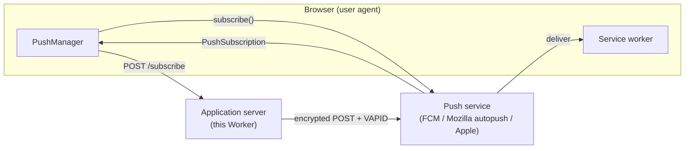
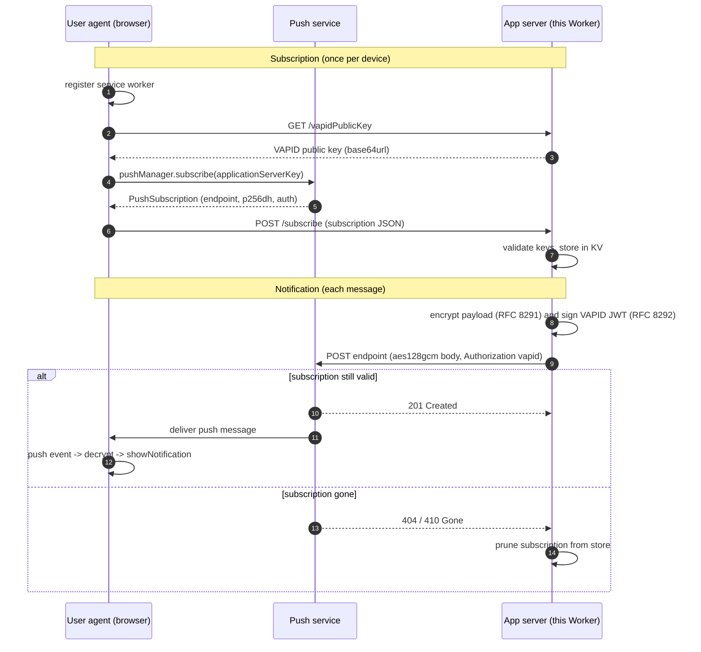
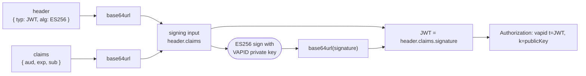
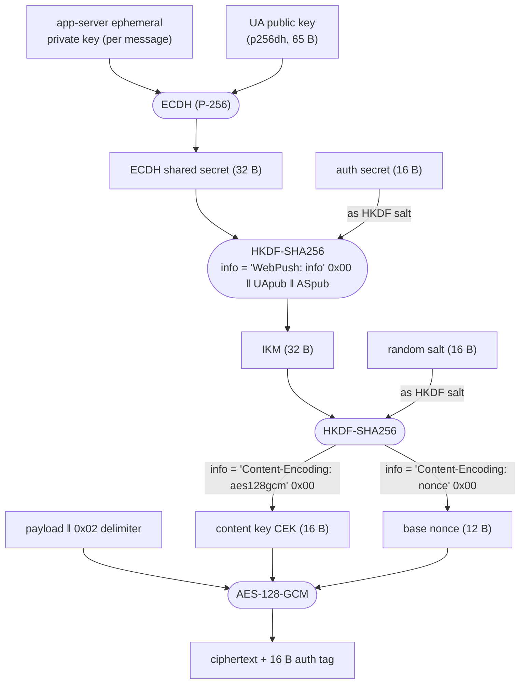
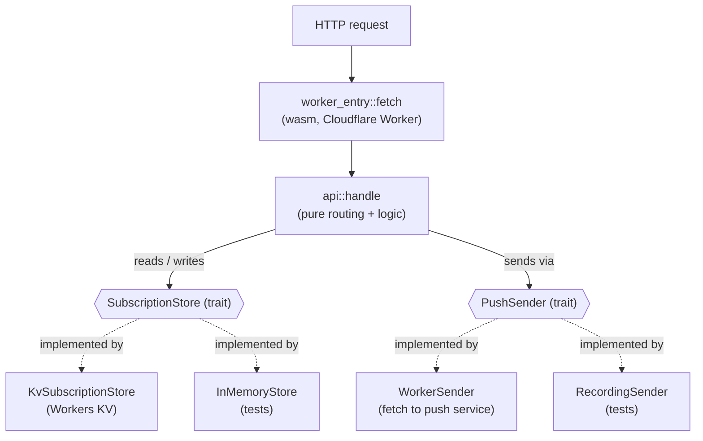
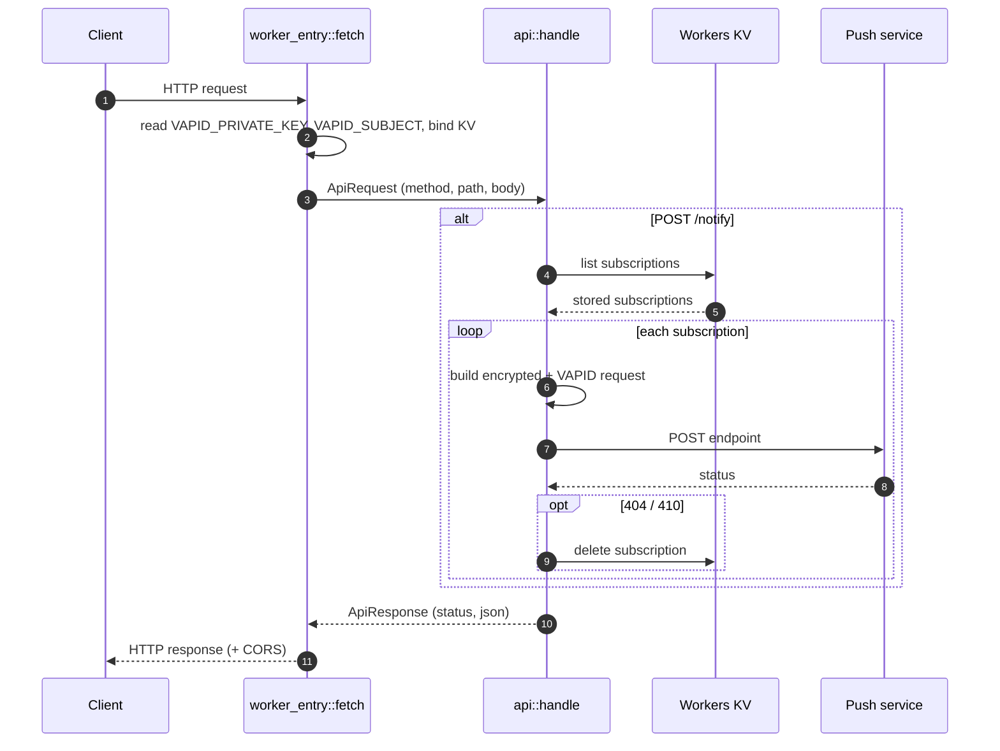

# How Web Push works (and how this backend implements it)

A guided, diagram-driven explanation of the Web Push protocol and how each
piece maps to the code in this directory. Read it top to bottom to learn the
whole flow, or jump to a section.

- [1. The cast: three parties](#1-the-cast-three-parties)
- [2. The end-to-end flow](#2-the-end-to-end-flow)
- [3. The PushSubscription](#3-the-pushsubscription)
- [4. VAPID: identifying the application server (RFC 8292)](#4-vapid-identifying-the-application-server-rfc-8292)
- [5. Encrypting the payload (RFC 8291 + RFC 8188)](#5-encrypting-the-payload-rfc-8291--rfc-8188)
- [6. The push request (RFC 8030)](#6-the-push-request-rfc-8030)
- [7. This backend's architecture](#7-this-backends-architecture)
- [8. Run it to learn](#8-run-it-to-learn)
- [9. Security & privacy](#9-security--privacy)
- [10. FAQ](#10-faq)
- [11. Glossary](#11-glossary)
- [12. Further reading](#12-further-reading)

---

## 1. The cast: three parties

Web Push always involves **three** independent parties. Keeping them straight is
the key to understanding everything else.



| Party | Who runs it | Role | Holds |
|-------|-------------|------|-------|
| **User agent** | The browser, on the user's device | Creates a subscription, receives & decrypts messages, shows notifications | A per-subscription **private** key (never leaves the device) |
| **Push service** | The browser vendor (Google for Chrome, Mozilla for Firefox, Apple for Safari) | A dumb, untrusted relay: queues and forwards messages to the device | Nothing it can read — only ciphertext |
| **Application server** | You (this Cloudflare Worker) | Stores subscriptions and sends encrypted, authenticated messages | The **VAPID** private key + the stored subscriptions |

Two ideas fall out of this picture, and the two big RFCs exist to enforce them:

1. **The push service must not read your payloads.** So the application server
   and the user agent share an end-to-end encryption scheme: **RFC 8291**
   (message encryption) layered on **RFC 8188** (the `aes128gcm` content
   encoding). The push service only ever sees ciphertext.
2. **Not just anyone should be able to push to a subscription.** So the
   application server identifies itself to the push service with a signed token:
   **RFC 8292** (VAPID).

---

## 2. The end-to-end flow

Here is the life of a notification, end to end. The left half (subscription)
happens once per device; the right half (notification) happens every time you
send.



Mapping to this codebase:

| Step | Endpoint / code |
|------|-----------------|
| `GET /vapidPublicKey` | `api.rs` → `WebPushClient::vapid_public_key` |
| `POST /subscribe` | `api.rs::subscribe` → `Subscription::validate` → `SubscriptionStore::put` |
| encrypt + sign | `push.rs::WebPushClient::build_request` → `ece::encrypt` + `vapid::authorization_header` |
| `POST endpoint` | `sender.rs::PushSender::send` (real impl: `worker_entry.rs::WorkerSender`) |
| prune on 404/410 | `sender.rs::PushResponse::is_gone` → `api.rs::notify` deletes |

---

## 3. The PushSubscription

When the browser subscribes, the push service hands it a `PushSubscription`.
The browser serializes it to JSON and your front-end POSTs it to `/subscribe`:

```json
{
  "endpoint": "https://fcm.googleapis.com/fcm/send/abcd...opaque-id",
  "expirationTime": null,
  "keys": {
    "p256dh": "BNcRdreALRFXTkOOUHK1EtK2wtaz5Ry4YfYCA_0QTpQtUbVlUls0VJXg7A8u-Ts1XbjhazAkj7I99e8QcYP7DkM",
    "auth": "tBHItJI5svbpez7KI4CCXg"
  }
}
```

Three fields matter:

- **`endpoint`** — a URL on the push service. Its **origin** (`scheme://host`)
  tells you *which* push service (e.g. `https://fcm.googleapis.com`), and the
  rest is an opaque per-subscription id. To send a message you HTTP `POST` to
  this URL.
- **`keys.p256dh`** — the user agent's **P-256 public key** (a 65-byte
  uncompressed EC point, base64url). You'll do ECDH against this to encrypt.
- **`keys.auth`** — a **16-byte shared authentication secret** (base64url), mixed
  into the key derivation so that knowing the public key alone isn't enough.

In code (`subscription.rs`): `Subscription::parse` decodes the JSON,
`receiver_keys()` validates and decodes `p256dh` into a `p256::PublicKey` and
`auth` into a `[u8; 16]`, and `id()` derives a stable id as
`base64url(SHA-256(endpoint))` — so re-subscribing with the same endpoint is
idempotent (it overwrites rather than duplicates).

---

## 4. VAPID: identifying the application server (RFC 8292)

**VAPID** = *Voluntary Application Server Identification*. Without it, push was
anonymous: anyone who learned an endpoint could send to it. VAPID lets your
server attach a signed token to each request so the push service can tie the
subscription to *you*.

### How the binding works

1. You generate **one** long-lived VAPID key pair (an ECDSA P-256 key). Run
   `cargo run --example genvapid` to make one.
2. The browser subscribes with `applicationServerKey = <your VAPID public key>`.
   The push service records that key against the new subscription.
3. Every push you send must carry a **VAPID JWT signed by the matching private
   key**, plus the public key in the request. The push service verifies the
   signature and that the key matches what the subscription was created with.

Net effect: only the holder of the VAPID **private** key can push to
subscriptions created with the corresponding public key.

### The token

The VAPID credential is a JWT (JSON Web Token) signed with **ES256** (ECDSA over
P-256 with SHA-256):



The three claims (`vapid.rs::sign_jwt`):

| Claim | Meaning | This backend |
|-------|---------|--------------|
| **`aud`** (audience) | The **origin** of the push endpoint, e.g. `https://fcm.googleapis.com`. Ties the token to one push service so it can't be replayed at another. | `push.rs::endpoint_origin` |
| **`exp`** (expiry) | Absolute Unix time the token stops being valid. RFC 8292 caps this at **24h** in the future; this backend uses **12h** and clamps to 24h. Limits the replay window if a token leaks. | `WebPushClient::new` clamps; `build_request_with` sets `now + ttl` |
| **`sub`** (subject) | A **contact URI for the server operator** — `mailto:you@example.com` or `https://you.example/contact`. *Not* a secret or login; it's how the push service reaches you about problems. Required and must be well-formed. | `VAPID_SUBJECT` var (default `mailto:admin@example.com`) |

The signed token goes into the request as:

```
Authorization: vapid t=<JWT>, k=<base64url VAPID public key>
```

(`vapid.rs::authorization_header`.) Note the signature uses **deterministic
ECDSA** (RFC 6979), so signing the same input twice yields the same bytes —
handy for reproducible tests.

> **Two different key pairs!** Don't confuse them:
> - the **VAPID** key pair is long-lived, identifies the *server*, and signs JWTs;
> - the **ephemeral** key pair in the next section is fresh *per message* and is
>   used only to encrypt that one payload.

---

## 5. Encrypting the payload (RFC 8291 + RFC 8188)

Goal: only the user agent can read the payload. The push service stores and
forwards **ciphertext**.

### The ingredients

- **UA public key** (`p256dh`) and **`auth` secret** — from the subscription.
- A **fresh, ephemeral P-256 key pair** generated by the app server **for this
  one message**.
- A **random 16-byte salt**, also fresh per message.

Freshness per message means every message uses unique encryption keys even to
the same subscriber.

### The key schedule

This is the heart of RFC 8291. Two HKDF-SHA256 passes turn an ECDH secret into
the AES key and nonce. (`‖` means byte concatenation.)



Step by step, with the code (`ece.rs`):

1. **ECDH**: `shared = ECDH(as_ephemeral_private, ua_public)` → 32 bytes.
2. **Combine with `auth`** (`webpush_ikm`): `IKM = HKDF(salt = auth, ikm = shared,
   info = "WebPush: info\0" ‖ ua_public ‖ as_public, len = 32)`. Mixing both
   public keys into `info` binds the keys to this exact pair of parties.
3. **Derive CEK and nonce** (`derive_cek_nonce`) from the random salt:
   - `CEK   = HKDF(salt, IKM, "Content-Encoding: aes128gcm\0", 16)`
   - `nonce = HKDF(salt, IKM, "Content-Encoding: nonce\0", 12)`
4. **Encrypt** (`content_encrypt`): append a `0x02` "last record" delimiter to
   the payload, then `AES-128-GCM(CEK, nonce)` → ciphertext + 16-byte tag.

### The body on the wire (RFC 8188)

The encrypted body is self-describing: it carries the salt and the app server's
ephemeral public key in a header, so the receiver can redo the ECDH and derive
the same keys.

```
byte:  0            16        20    21                       86                          end
       +------------+---------+-----+-------------------------+----------------------------+
       | salt       | rs      |idlen| keyid = AS ephemeral pub| ciphertext + GCM tag       |
       | 16 bytes   | 4 B, BE | 1 B | 65 bytes                | (payload ‖ 0x02) + 16 bytes|
       +------------+---------+-----+-------------------------+----------------------------+
        \____________ aes128gcm header (RFC 8188) ___________/
```

- **`rs`** (record size) = 4096 here (`DEFAULT_RECORD_SIZE`). Web Push payloads
  are small (< 4 KB), so the whole message is a single record.
- **`idlen` = 65** and **`keyid`** = the app server's ephemeral public key.

The user agent reverses all of this (`ece::decrypt`): read `salt` + `keyid`,
ECDH `keyid` against its own private key, rebuild `IKM`/`CEK`/`nonce`, GCM-decrypt,
strip the `0x02` delimiter, and hand the plaintext to the service worker.

### How we know it's correct

- `ece.rs` includes the **RFC 8188 Appendix A.1 known-answer test**
  (`rfc8188_a1_known_answer`): given the RFC's exact inputs, our content
  encoding reproduces the RFC's exact output byte-for-byte.
- `webpush_round_trip` encrypts then decrypts and checks the plaintext.
- The integration test goes further: it encrypts via the real API, then
  **decrypts as the user agent** with the subscription's private key.

---

## 6. The push request (RFC 8030)

Putting VAPID and the ciphertext together, a push is just an HTTP `POST` to the
endpoint (`push.rs::build_request_with`):

```http
POST /fcm/send/abcd...opaque-id HTTP/1.1
Host: fcm.googleapis.com
TTL: 86400
Content-Encoding: aes128gcm
Content-Type: application/octet-stream
Urgency: normal
Topic: news
Authorization: vapid t=eyJ0eXAiOiJKV1Qi..., k=BNcRdreALRFX...

<binary aes128gcm body from section 5>
```

| Header | Meaning |
|--------|---------|
| `TTL` | Seconds the push service may hold the message if the device is offline. `0` = deliver now or drop. |
| `Content-Encoding: aes128gcm` | Declares the body encoding from section 5. |
| `Urgency` | `very-low` / `low` / `normal` / `high` — battery vs. latency hint (`push.rs::Urgency`). |
| `Topic` | Optional. A new message with the same topic replaces an older undelivered one (collapsing). |
| `Authorization` | The VAPID credential from section 4. |

Response codes you'll see (`sender.rs::PushResponse`):

| Status | Meaning | This backend |
|--------|---------|--------------|
| `201 Created` | Queued for delivery | counted as success |
| `400` / `401` / `403` | Bad/expired VAPID JWT, or key mismatch | counted as failure |
| `404` / `410 Gone` | Subscription no longer exists | **pruned** from the store (`is_gone`) |
| `413` | Payload too large (> ~4 KB encrypted) | failure |
| `429` | Rate limited (respect `Retry-After`) | failure |

---

## 7. This backend's architecture

The trick that makes this testable without a browser, a push service, or a
deployment is a pair of **traits** that the core logic depends on. Production
plugs in Cloudflare implementations; tests plug in fakes.



- **`api::handle`** is a plain `async` function over `&dyn SubscriptionStore`
  and `&dyn PushSender`. It has no idea whether it's running in a Worker or a
  test. This is where routing, validation, encryption, signing, and pruning live.
- **`worker_entry.rs`** (compiled only for `wasm32`) is the thin Cloudflare
  glue: it reads config from the environment, wraps Workers **KV** as a
  `SubscriptionStore`, wraps the **`fetch`** API as a `PushSender`, adds CORS,
  and calls `api::handle`.
- The integration tests construct `InMemoryStore` + `RecordingSender` and call
  the *same* `api::handle`, so they exercise the real code paths.

Inside the Worker, one request flows like this:



---

## 8. Run it to learn

You can learn the entire protocol **without deploying anything** — the tests use
in-memory fakes.

```bash
cd web-push

# 1. Watch the crypto prove itself against the RFC test vector.
cargo test ece::tests::rfc8188_a1_known_answer -- --nocapture

# 2. Read + run the full end-to-end test (subscribe → notify → decrypt → verify VAPID).
cargo test --test integration end_to_end_subscribe_notify_and_decrypt

# 3. Generate a VAPID key pair and look at it.
cargo run --example genvapid

# 4. Build the actual Cloudflare Worker (wasm).
cargo build --target wasm32-unknown-unknown
```

Good files to read, in order: `subscription.rs` → `vapid.rs` → `ece.rs`
(start at `encrypt`) → `push.rs` → `api.rs` → `worker_entry.rs`.

### When you *do* want to run it as a Worker

Workers are stateless between requests, so you need a **KV namespace** to
persist subscriptions. You don't have one yet — here's how to create it. (This
is only needed for an actual Cloudflare deploy; `wrangler dev` simulates KV
locally and the tests need none.)

```bash
npm install -g wrangler
cargo install worker-build

# Create the namespaces (wrangler prints an id for each).
wrangler kv namespace create SUBSCRIPTIONS
wrangler kv namespace create SUBSCRIPTIONS --preview
# (older wrangler used a colon: `wrangler kv:namespace create SUBSCRIPTIONS`)
```

`wrangler` prints something like:

```toml
[[kv_namespaces]]
binding = "SUBSCRIPTIONS"
id = "0f2ac74b498b48028cb68387c421e279"
```

Copy the `id` (and the `--preview` one as `preview_id`) into the
`[[kv_namespaces]]` block in `wrangler.toml`. Then set the VAPID identity and
run:

```bash
cargo run --example genvapid            # copy the private key
wrangler secret put VAPID_PRIVATE_KEY   # paste it (a secret, not a var)
# VAPID_SUBJECT lives in wrangler.toml [vars] — set it to a real mailto: you own

wrangler dev      # local, with a simulated KV
wrangler deploy   # production
```

### See it in a real browser

Once the Worker is reachable, open the **[`web-push-demo`](../../web-push-demo/)**
front-end (a static page this repo deploys to GitHub Pages). Paste your Worker
URL, click **Subscribe**, then **Send notification** — you'll watch a real push
travel from `/notify` through the push service to the service worker's `push`
event and a system notification. It's the browser half of the same flow the
integration test exercises in memory.

---

## 9. Security & privacy

- **What the push service can see:** the endpoint, request headers (`TTL`,
  `Urgency`, `Topic`), your VAPID JWT (which includes your `sub` contact), and
  the ciphertext's **size and timing** — but **never the plaintext**.
- **Keys:**
  - The **UA private key** never leaves the user's device.
  - The **VAPID private key** is a server secret — store it with
    `wrangler secret put`, never in `wrangler.toml` or git.
  - The **ephemeral** message key is generated fresh per message and discarded.
- **Replay defenses:** `exp` bounds how long a leaked JWT is usable; `aud` binds
  it to one push service.
- **Treat subscriptions as sensitive.** An endpoint plus keys is close to a
  capability to message that user; don't log `auth`/`p256dh` and protect the KV
  store.
- **Payload size:** keep encrypted bodies under ~4 KB; push services reject
  larger ones (`413`).

---

## 10. FAQ

**What exactly is the VAPID `sub`?**
A contact URI for whoever runs the application server (`mailto:` or `https:`).
It's how the push service reaches you about abuse/operational issues. It is not
authentication — the ECDSA signature is — but it must be present and valid.

**I don't have a KV namespace. Can I still use this?**
Yes. You need KV only to *deploy*. Everything in this repo — all tests, the
crypto, the API logic — runs against an in-memory store. Create a namespace
(section 8) only when you deploy to Cloudflare.

**Why two P-256 key pairs?**
The **VAPID** pair is long-lived and identifies the server (signs JWTs). The
**ephemeral** pair is per-message and only encrypts that one payload. They serve
different purposes (ECDSA signing vs. ECDH encryption) and must not be reused for
each other.

**Why is the ECDSA signature the same every run for the same input?**
RustCrypto uses deterministic ECDSA (RFC 6979). Same key + same message =
same signature, which makes tests reproducible. It's still secure.

**Does the push service decrypt my message?**
No. It only relays the `aes128gcm` body. Only the user agent (which holds the
subscription private key) can decrypt it.

**Can I send a notification to one subscriber?**
Yes — `POST /notify` with `"id": "<subscription-id>"`. Omit `id` to broadcast.

---

## 11. Glossary

| Term | Meaning |
|------|---------|
| **User agent** | The browser; runs the service worker and holds the subscription private key. |
| **Push service** | Vendor-run relay (FCM, Mozilla autopush, Apple). Untrusted; sees only ciphertext. |
| **Application server** | Your backend (this Worker) that stores subscriptions and sends messages. |
| **Service worker** | Background script in the browser that receives the `push` event and shows the notification. |
| **PushSubscription** | `{ endpoint, keys.p256dh, keys.auth }` produced by `pushManager.subscribe`. |
| **VAPID** | Voluntary Application Server Identification (RFC 8292); a signed ES256 JWT. |
| **`aud` / `exp` / `sub`** | VAPID JWT claims: push-service origin / expiry / operator contact. |
| **ECDH** | Elliptic-Curve Diffie–Hellman; turns two key pairs into one shared secret. |
| **HKDF** | HMAC-based key derivation; expands a secret into keys/nonces. |
| **CEK** | Content-Encryption Key — the 16-byte AES-128-GCM key. |
| **aes128gcm** | The Encrypted Content-Encoding from RFC 8188 used for the body. |
| **Record size (`rs`)** | Max bytes per encryption record; 4096 here (one record per message). |
| **KV** | Cloudflare Workers KV, a key-value store used here to persist subscriptions. |

---

## 12. Further reading

- [MDN: Push API](https://developer.mozilla.org/en-US/docs/Web/API/Push_API)
- [RFC 8030 — Generic Event Delivery Using HTTP Push](https://www.rfc-editor.org/rfc/rfc8030)
- [RFC 8188 — Encrypted Content-Encoding for HTTP](https://www.rfc-editor.org/rfc/rfc8188)
- [RFC 8291 — Message Encryption for Web Push](https://www.rfc-editor.org/rfc/rfc8291)
- [RFC 8292 — VAPID for Web Push](https://www.rfc-editor.org/rfc/rfc8292)
- [Cloudflare Workers KV](https://developers.cloudflare.com/kv/)
- [workers-rs](https://github.com/cloudflare/workers-rs)
